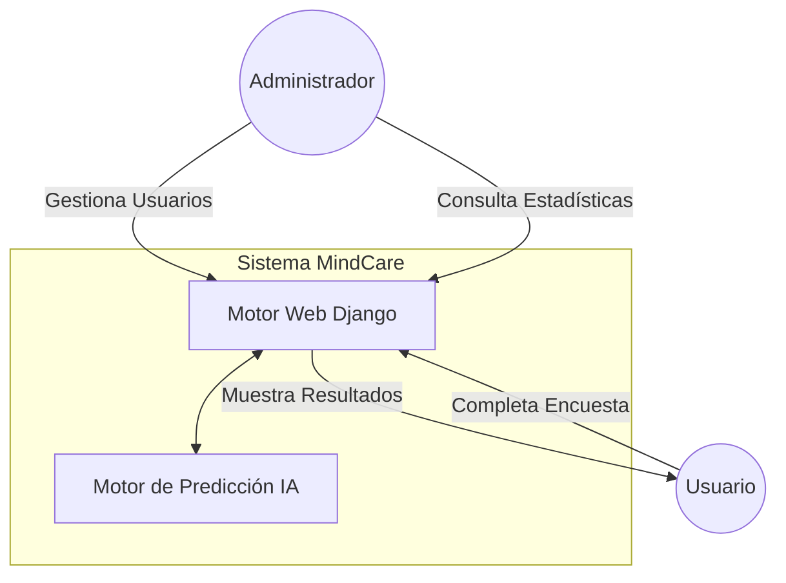

# IEEE 1016 - 01. Introducción

## 1.1 Propósito
Este documento establece las bases del diseño del sistema **MindCare**, una solución de software orientada a la evaluación preventiva de salud mental mediante Inteligencia Artificial. El objetivo es proporcionar una guía técnica exhaustiva para el desarrollo, mantenimiento y evolución del sistema.

## 1.2 Alcance
MindCare es una plataforma web integral que:
- Digitaliza la captura de datos psicométricos y demográficos.
- Ejecuta modelos de Machine Learning (Random Forest) para la predicción de necesidades de tratamiento.
- Proporciona analítica de datos masivos para tomadores de decisiones.
- Gestiona identidades y roles de acceso bajo protocolos de seguridad web.

## 1.3 Contexto del Sistema (Diagrama de Contexto UML)
El sistema interactúa con dos actores principales: los Usuarios (encuestados) y los Administradores (investigadores).

## 1.4 Objetivos de Diseño
- **Modularidad**: Separación clara entre la lógica de negocio y la lógica de IA.
- **Fiabilidad**: Resultados consistentes basados en modelos entrenados.
- **Privacidad**: Manejo ético y seguro de datos sensibles de salud mental.
