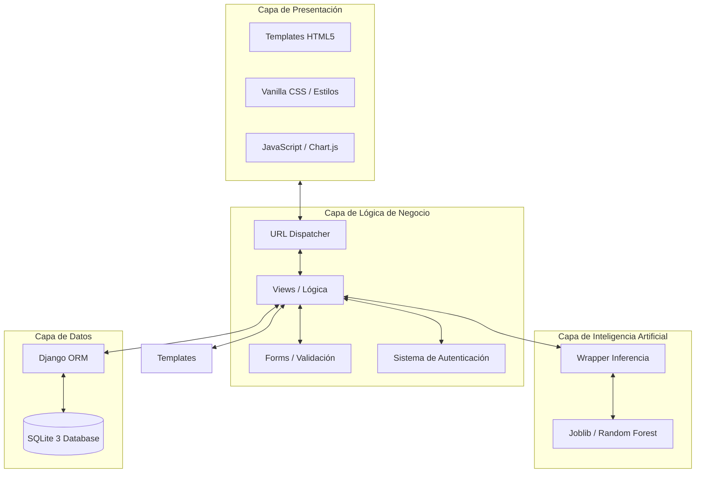

# IEEE 1016 - 02. Arquitectura del Sistema

## 2.1 Patrón Arquitectónico: MVT (Model-View-Template)
MindCare implementa el patrón MVT de Django para desacoplar la gestión de datos, la lógica de control y la interfaz de usuario.

### 2.2 Diagrama de Arquitectura Detallado (UML Package)

## 2.3 Descomposición de Subsistemas
1.  **Subsistema de Encuestas**: Gestiona la lógica multietapa de la captura de datos.
2.  **Subsistema de Identidad**: Basado en `django.contrib.auth`, maneja el control de acceso basado en roles (RBAC).
3.  **Subsistema Analítico**: Procesa las respuestas almacenadas para generar distribuciones estadísticas a través de `Chart.js`.
4.  **Subsistema Predictivo**: Componente asíncrono que realiza inferencias ML.

## 2.4 Decisiones Técnicas Clave
- **Django**: Elegido por su seguridad integrada (Batteries included).
- **SQLite**: Utilizado por su portabilidad para entornos de investigación.
- **Random Forest**: Seleccionado por su capacidad para manejar datos categóricos y su interpretabilidad.
