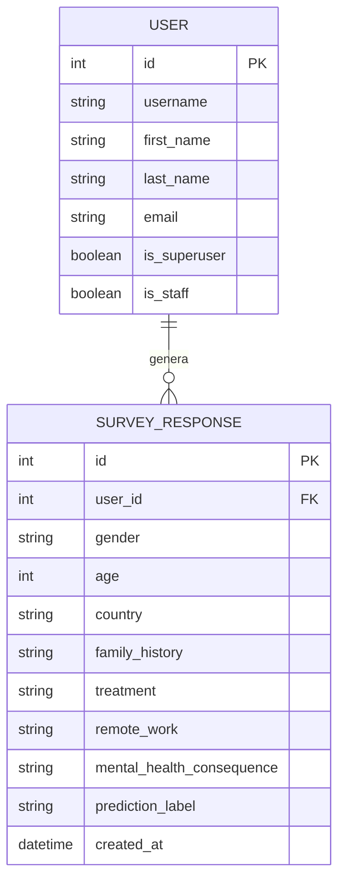

# IEEE 1016 - 03. Diseño de Datos

## 3.1 Esquema Lógico (Diagrama Entidad-Relación)
El diseño de datos se centra en la relación entre el usuario corporativo y sus registros históricos de salud mental.

## 3.2 Diccionario de Datos (Principales Campos)

| Entidad | Campo | Tipo | Descripción |
| :--- | :--- | :--- | :--- |
| **User** | `username` | String | Identificador único para el inicio de sesión. |
| **User** | `is_superuser` | Boolean | Define si tiene acceso al Panel de Administración. |
| **Response** | `family_history` | String | Factor crítico para el modelo de IA (Sí/No). |
| **Response** | `treatment` | String | Variable objetivo real (si el usuario ya recibe tratamiento). |
| **Response** | `prediction_label` | String | Resultado generado por el motor de inferencia IA. |

## 3.3 Estrategia de Persistencia
- **ORM (Object-Relational Mapping)**: Se utiliza el ORM de Django para abstraer las consultas SQL y garantizar la seguridad contra inyecciones SQL.
- **Migraciones**: El esquema se gestiona mediante el sistema de migraciones de Django para asegurar la integridad estructural entre versiones.
- **Base de Datos**: SQLite 3 configurada para almacenamiento local eficiente.
