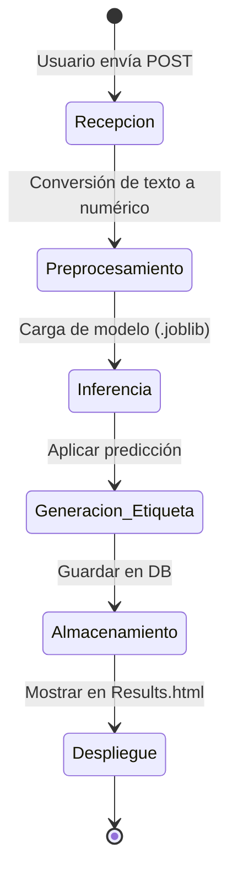
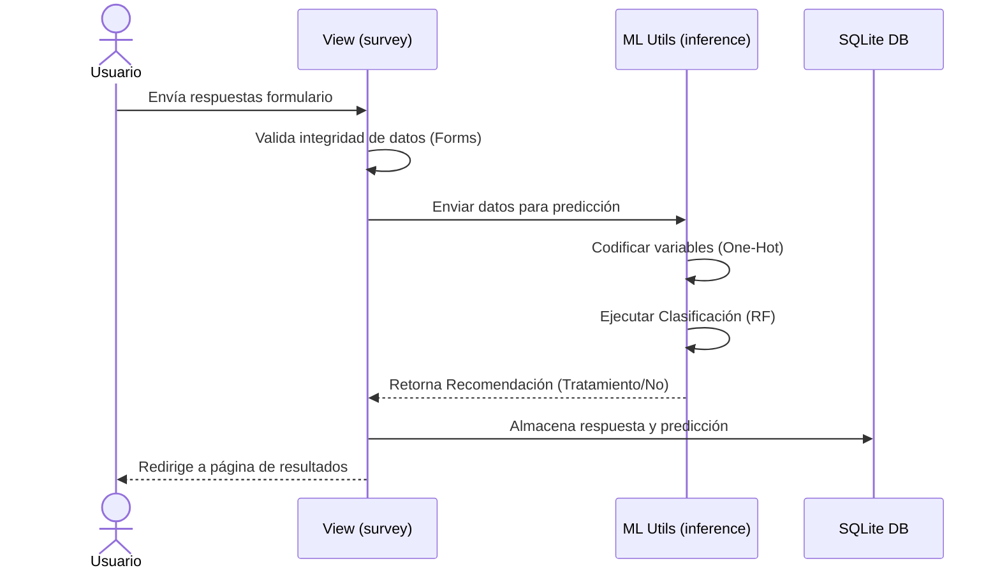

# IEEE 1016 - 04. Diseño de Detalle (Inteligencia Artificial)

## 4.1 Especificación del Modelo
El "cerebro" de MindCare es un clasificador basado en el algoritmo **Random Forest**, entrenado con el dataset de salud mental en la industria tech.

## 4.2 Pipeline de Inferencia (Diagrama de Estado UML)
El proceso desde que se recibe la encuesta hasta que se entrega la predicción.

## 4.3 Diagrama de Secuencia de Predicción (UML Sequence)

## 4.4 Características del Modelo
- **Variables de entrada**: 16 variables categóricas y numéricas.
- **Tipo de aprendizaje**: Supervisado (Clasificación binaria).
- **Herramientas**: Scikit-Learn, Joblib, NumPy, Pandas.
- **Interpretabilidad**: El uso de Random Forest permite extraer la importancia de las características (Feature Importance), lo cual es crucial para la ética en salud mental.
