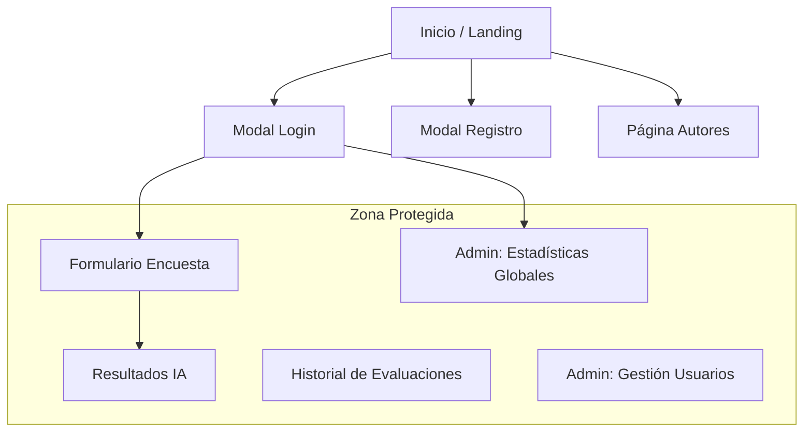
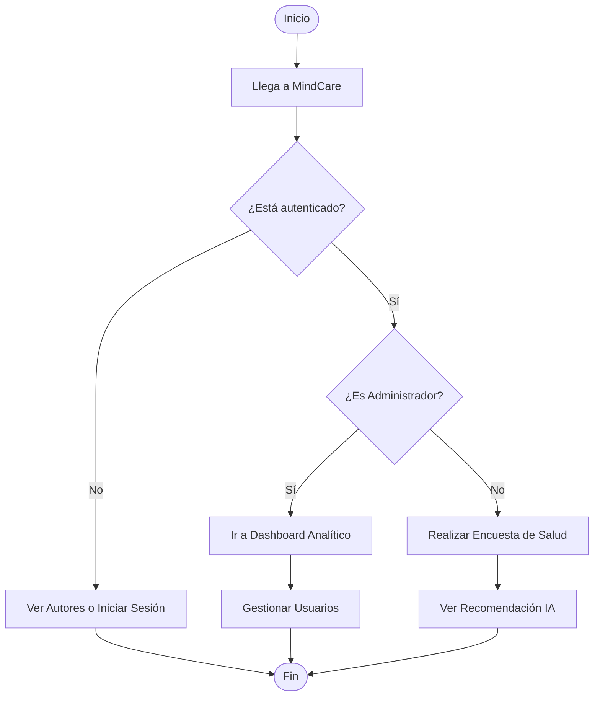

# IEEE 1016 - 05. Diseño de Interfaces (UI/UX)

## 5.1 Arquitectura de la Información (Sitemap)

## 5.2 Diseño de Componentes de Interfaz
- **Navegación Dinámica**: El encabezado cambia según el rol del usuario (Admin vs Usuario Final).
- **Formulario Multietapa con Ayuda Contextual**: Implementación JavaScript para navegación suave entre pasos de la encuesta.
- **Gráficos Estadísticos**: Integración de **Chart.js** para renderizar distribuciones de datos en el Dashboard.

## 5.3 Interfaces Externas
- **Navegadores**: Optimizado para Chrome, Firefox y Safari.
- **Protocolo de Comunicación**: HTTP/HTTPS con respuestas en formato JSON para endpoints de gestión de usuarios (AJAX).
- **Framework de Estilo**: Vanilla CSS con variables CSS personalizadas para mantener una estética consistente (Glassmorphism, Modo Oscuro/Laro equilibrado).

## 5.4 Flujo de Navegación del Usuario (UML Activity)

