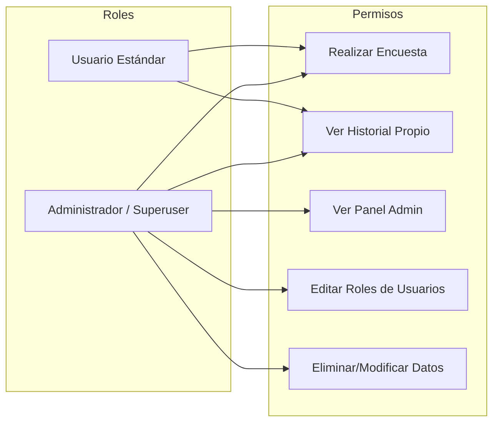

# IEEE 1016 - 06. Gestión de Usuarios y Seguridad

## 6.1 Control de Acceso Basado en Roles (RBAC)
MindCare implementa una estructura jerárquica de permisos.

## 6.2 Protocolos de Seguridad Implementados
1.  **Protección CSRF (Cross-Site Request Forgery)**: Django inyecta tokens obligatorios en todos los formularios POST para prevenir ataques maliciosos.
2.  **Seguridad de Contraseñas**: Uso del algoritmo **PBKDF2 con salt** (estándar de Django) para el almacenamiento de credenciales.
3.  **Prevención de XSS**: El motor de templates escapa automáticamente cualquier contenido HTML malintencionado.
4.  **Control de Sesiones**: Expiración automática de sesiones y validación de cookies de seguridad (`HttpOnly`, `Secure`).

## 6.3 Verificación y Pruebas
- **Pruebas de Funcionalidad**: Validación del CRUD de usuarios.
- **Pruebas de Seguridad**: Intento de acceso a `/dashboard/` por parte de usuarios no administradores (debe redirigir al Login).
- **Pruebas de Carga de IA**: Verificación de estabilidad al recibir múltiples solicitudes de predicción simultáneas.
