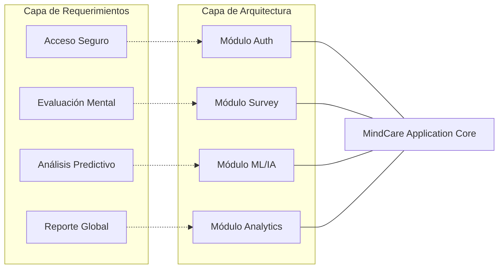

# IEEE 1016 - 07. Matriz de Trazabilidad de Requerimientos (RTM)

## 7.1 Propósito y Alcance
La Matriz de Trazabilidad de Requerimientos (RTM) es un componente crítico del diseño de software que asegura la integridad bidireccional entre las necesidades del usuario y la implementación técnica. Garantiza que:
1. No existan requerimientos funcionales sin una solución técnica asignada.
2. Cada componente de software tenga una justificación originada en un requerimiento.

## 7.2 Mapeo Detallado (Matriz RTM)

| ID REQ | Requerimiento Funcional | Componente del Sistema | Módulo (App: Django) | Capa del Diseño |
| :--- | :--- | :--- | :--- | :--- |
| **RF01** | Registro de Usuarios (Pacientes) | `User Management` | `core.views.register` | Lógica de Negocio |
| **RF02** | Inicio de Sesión Seguro | `Identity Engine` | `core.views.login_view`| Seguridad |
| **RF03** | Captura de Respuesta de Encuesta | `Survey Engine` | `core.forms.SurveyForm`| Interfaces de Usuario |
| **RF04** | Análisis de Riesgo vía IA | `AI Prediction Engine`| `core.ml_utils.predict`| Servicio de Inferencia |
| **RF05** | Visualización de Historial | `Historical Portal` | `core.views.history` | Persistencia |
| **RF06** | Dashboard de Métricas Salud | `Analytics Hub` | `core.views.dashboard` | Inteligencia de Negocio |
| **RF07** | Gestión Administrativa | `Admin Interface` | `core.admin.py` | Administración |
| **RF08** | Cierre de Sesión Seguro | `Session Manager` | `core.views.logout_view`| Control de Acceso |

## 7.3 Diagrama de Trazabilidad de Flujo (UML)

## 7.4 Trazabilidad de Requerimientos No Funcionales (RNF)

| ID RNF | Atributo de Calidad | Mecanismo de Implementación | Sección de Diseño |
| :--- | :--- | :--- | :--- |
| **RNF01** | Seguridad | Encriptación de datos y protección CSRF nativa. | Sección 06 / 32 |
| **RNF02** | Rendimiento | Carga diferida del modelo Random Forest con Joblib. | Sección 27 |
| **RNF03** | Accesibilidad | Cumplimiento de estándares WCAG 2.1 (AA). | Sección 24 |
| **RNF04** | Usabilidad | Diseño responsivo y navegación simplificada. | Sección 05 / 33 |

