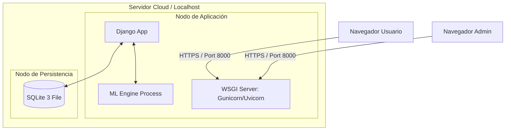

# IEEE 1016 - 08. Diseño de Despliegue y Recursos

## 8.1 Topología de Despliegue (Diagrama de Despliegue UML)
Describe cómo el software MindCare se distribuye en la infraestructura de hardware/nube.

## 8.2 Requisitos de Recursos de Hardware
- **CPU**: Mínimo 2 núcleos (Recomendado para procesamiento de modelos de IA en paralelo).
- **RAM**: 4GB (Mínimo), 8GB (Recomendado para manejar grandes volúmenes de datos en el Dashboard).
- **Almacenamiento**: 500MB para la aplicación y 1GB+ para el crecimiento de la base de datos y modelos.

## 8.3 Recursos de Software
- **Sistema Operativo**: Linux (Ubuntu/Debian) o macOS.
- **Entorno de Ejecución**: Python 3.10 o superior.
- **Dependencias Clave**: `django`, `scikit-learn`, `joblib`, `pandas`, `numpy`.

## 8.4 Estrategia de Entrega Continua
La aplicación utiliza un flujo de despliegue simplificado mediante Git y entornos virtuales de Python (venv) para asegurar la reproducibilidad térmica y de dependencias.
