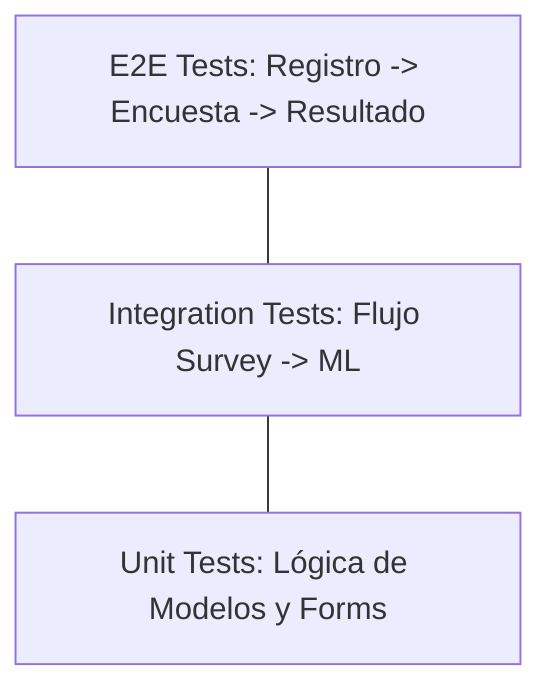

# IEEE 1016 - 09. Plan de Pruebas y Aseguramiento de Calidad (SQA)

## 9.1 Estrategia de Calidad
MindCare utiliza un enfoque de pirámide de pruebas para garantizar la estabilidad del diagnóstico basado en IA.

## 9.2 Niveles de Prueba (Diagrama de Pirámide)

## 9.3 Casos de Prueba Críticos

| ID de Prueba | Componente | Acción | Resultado Esperado |
| :--- | :--- | :--- | :--- |
| **TC1** | Autenticación | Cierre de sesión y re-acceso | Sesión invalidada correctamente. |
| **TC2** | AI Engine | Enviar vector de datos nulo | Manejo de excepción y error amigable. |
| **TC3** | Dashboard | Carga de 10k respuestas | Renderizado de gráficos en < 2 segundos. |
| **TC4** | User Management | Rol de Admin removido a sí mismo | El sistema debe bloquear la acción (Protección implementada). |

## 9.4 Verificación del Modelo de IA
Se realizan pruebas de consistencia (Backtesting) comparando las predicciones del modelo integrado frente a los resultados del entorno de entrenamiento original para asegurar que la exportación `.joblib` no degradó la precisión del Random Forest.
