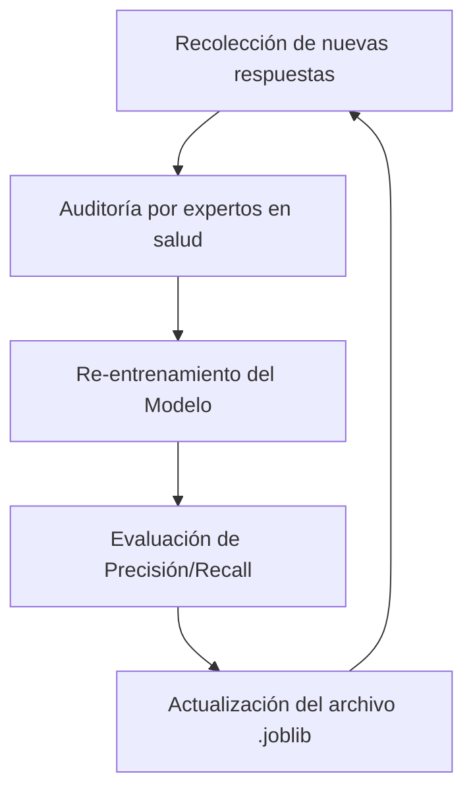

# IEEE 1016 - 10. Mantenimiento y Gestión de Configuración

## 10.1 Gestión de Cambios
El mantenimiento de MindCare se rige por un ciclo de vida de desarrollo de software (SDLC) iterativo.

## 10.2 Control de Versiones
- **Repositorio**: Git.
- **Flujo de Trabajo**: GitFlow (Ramas para Features, Develop y Main).

## 10.3 Ciclo de Vida del Modelo de IA (MLOps)
Debido a que la salud mental es un campo dinámico, el modelo de IA requiere mantenimiento periódico.

## 10.4 Copias de Seguridad (Backup)
- **Base de Datos**: Respaldos diarios automáticos del archivo `db.sqlite3`.
- **Código**: Versionamiento en la nube (GitHub/GitLab).

## 10.5 Procedimientos de Parches
Toda actualización de seguridad en el framework Django debe ser aplicada en un plazo máximo de 7 días tras su liberación en los canales oficiales.
