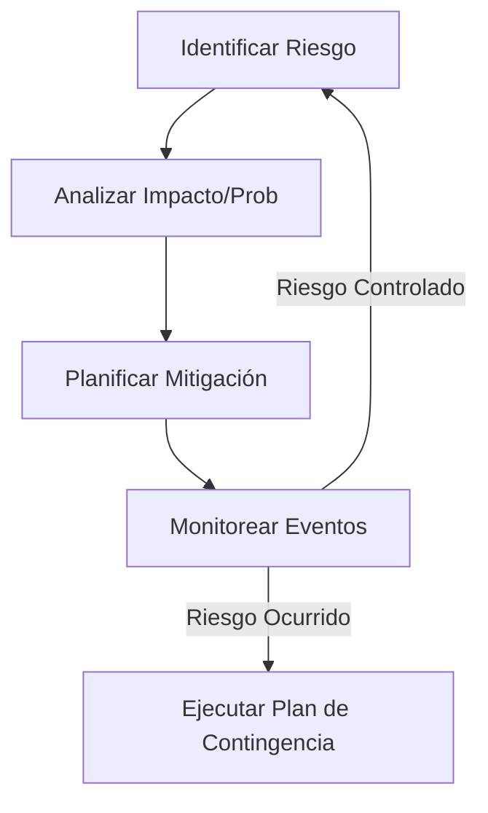

# IEEE 1016 - 11. Análisis de Riesgos y Mitigación

## 11.1 Identificación de Riesgos
En el desarrollo de MindCare, se han identificado riesgos técnicos y operativos que podrían afectar la integridad del sistema o la precisión de los diagnósticos.

## 11.2 Matriz de Riesgos

| ID | Riesgo | Impacto | Probabilidad | Estrategia de Mitigación |
| :--- | :--- | :--- | :--- | :--- |
| **R1** | Sesgo en el Modelo de IA | Alto | Media | Uso de datasets balanceados y auditorías periódicas de equidad algorítmica. |
| **R2** | Fuga de Datos Sensibles | Crítico | Baja | Implementación de encriptación AES-256 y cumplimiento de normativas de privacidad. |
| **R3** | Incompatibilidad de Navegador | Bajo | Media | Pruebas multiplataforma y uso de Vanilla JS/CSS estándar. |
| **R4** | Caída del Servidor (Downtime) | Medio | Baja | Monitorización activa y planes de redundancia en la nube. |

## 11.3 Diagrama de Flujo de Gestión de Riesgos

## 11.4 Contingencia Crítica
En caso de que el modelo de IA genere resultados inconsistentes, el sistema tiene un mecanismo de "Safe Mode" que desactiva temporalmente las predicciones y muestra un mensaje de contacto directo con profesionales de salud mental.
