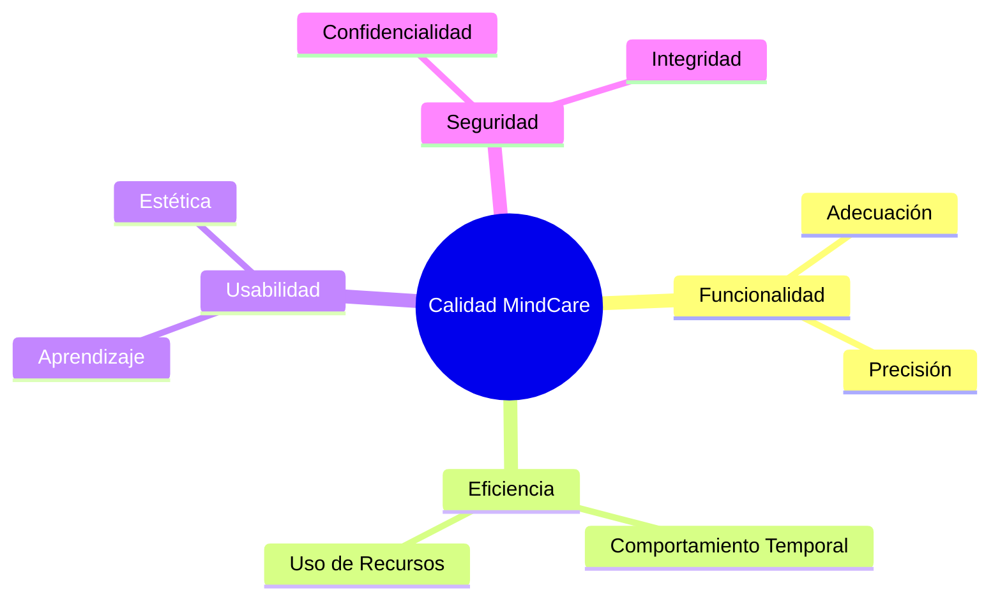

# IEEE 1016 - 12. Estándares de Codificación y Calidad

## 12.1 Estilo de Programación
Para asegurar la legibilidad y mantenibilidad del código, MindCare sigue las guías de estilo estándar para cada lenguaje utilizado.

- **Python**: Cumplimiento estricto de **PEP 8**. Uso de nombres descriptivos para funciones (`get_user_responses`) y variables.
- **HTML/CSS**: Uso de metodologías de nombrado semántico. CSS organizado por componentes.
- **JavaScript**: Estilo moderno (ES6+), sin dependencias pesadas innecesarias.

## 12.2 Revisiones de Código (Code Review)
Todo cambio en el repositorio debe pasar por un proceso de revisión por pares enfocado en:
1.  **Correctitud lógica**.
2.  **Eficiencia del algoritmo**.
3.  **Seguridad (validación de inputs)**.

## 12.3 Diagrama de Calidad de Software (ISO 25010)

## 12.4 Herramientas de Análisis Estático
Se recomienda el uso de `Flake8` y `Pylint` para detectar errores potenciales antes del despliegue en producción.
