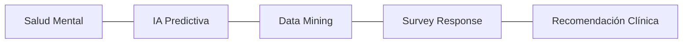

# IEEE 1016 - 13. Glosario y Definiciones Técnicas

## 13.1 Propósito
Este glosario define los términos técnicos y de dominio utilizados a lo largo de toda la documentación de ingeniería de MindCare para evitar ambigüedades.

## 13.2 Términos Técnicos

| Término | Definición |
| :--- | :--- |
| **Django** | Framework de alto nivel para desarrollo web en Python utilizado como núcleo del sistema. |
| **Random Forest** | Algoritmo de aprendizaje supervisado basado en múltiples árboles de decisión usado para la predicción de salud. |
| **Inferencia** | Acción de aplicar el modelo de IA ya entrenado sobre nuevos datos de un usuario para obtener una predicción. |
| **One-Hot Encoding** | Técnica de procesamiento de datos que convierte variables categóricas en vectores binarios numéricos. |
| **CSRF** | Cross-Site Request Forgery; tipo de ataque que MindCare mitiga mediante tokens de seguridad únicos. |
| **RBAC** | Role-Based Access Control; diseño de seguridad que asigna permisos según el rol del usuario (Admin/User). |
| **Joblib** | Librería de Python utilizada para serializar y cargar eficientemente el modelo de Machine Learning. |

## 13.3 Mapa de Conceptos de Dominio

