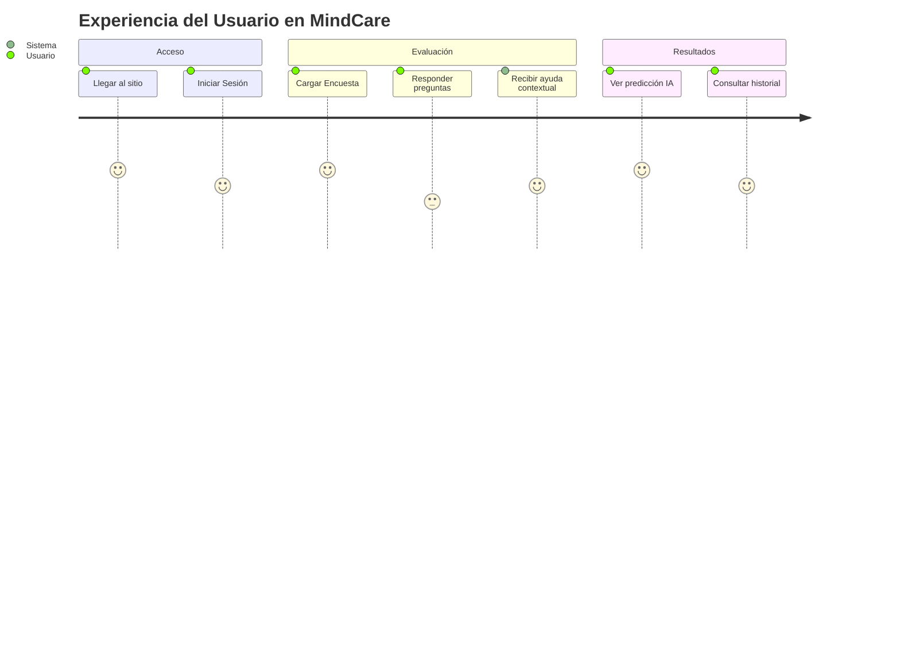

# IEEE 1016 - 14. Guía de Operación y Administración

## 14.1 Manual del Administrador
El administrador tiene acceso a herramientas críticas para el monitoreo del sistema.

### Gestión de Usuarios
- Acceso: `/users/`
- Funciones: Búsqueda, cambio de roles, activación/desactivación de cuentas.

### Análisis Estadístico
- Acceso: `/dashboard/`
- Interpretación: Los gráficos de barras y pasteles representan la distribución de salud mental en la población evaluada.

## 14.2 Flujo de Usuario Estándar (Diagrama UML)

## 14.3 Resolución de Problemas (Troubleshooting)
- **Error 500 al enviar encuesta**: Verificar que el archivo del modelo IA esté presente en el directorio correcto.
- **Gráficos no cargan**: Asegurar que la conexión a internet permite cargar la librería `Chart.js` desde el CDN (si aplica) o que el archivo local esté referenciado.
- **Problemas de Login**: Borrar cookies de sesión y verificar que el usuario esté marcado como "Activo" en la base de datos.
