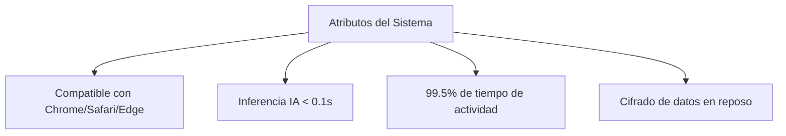

# IEEE 1016 - 15. Especificación de Requerimientos de Software (SRS)

## 15.1 Perspectiva del Producto
MindCare se posiciona como una herramienta de apoyo primario en la detección de riesgos de salud mental. No reemplaza un diagnóstico médico, pero proporciona una base basada en datos.

## 15.2 Requerimientos Funcionales Detallados

| ID | Nombre | Prioridad | Descripción |
| :--- | :--- | :--- | :--- |
| **RF.01** | Gestión de Perfil | Alta | El usuario debe poder actualizar su nombre y correo. |
| **RF.02** | Persistencia de Encuesta | Crítica | Las respuestas deben guardarse incluso si el usuario cierra la sesión antes de ver los resultados. |
| **RF.03** | Visualización de Tendencias | Media | El dashboard debe permitir filtrar datos por rango de fechas (Planificado). |
| **RF.04** | Exportación de Datos | Baja | Administradores podrán descargar reportes en CSV/PDF. |

## 15.3 Requerimientos de Atributos del Sistema (RNF)

## 15.4 Restricciones de Diseño
- El backend debe permanecer en Python para compatibilidad con librerías de IA.
- La base de datos debe ser ligera para despliegue en servidores de bajos recursos.
- La interfaz debe ser accesible (WCAG 2.1) para usuarios con diferentes capacidades.
