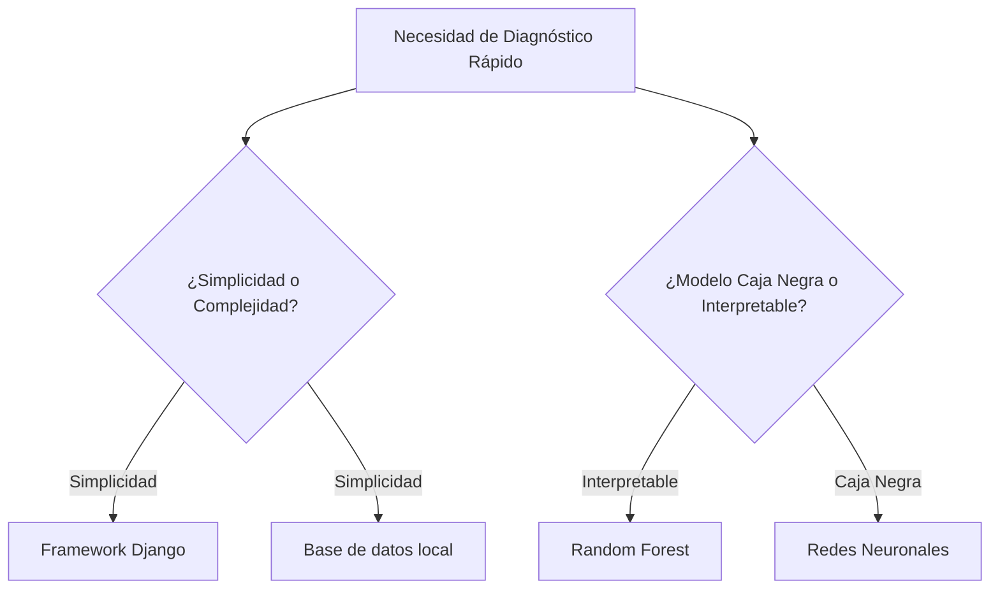

# IEEE 1016 - 16. Justificación del Diseño (Rationales)

## 16.1 Decisiones Arquitectónicas
Este módulo documenta el "por qué" detrás de las elecciones técnicas más importantes, permitiendo que futuros desarrolladores comprendan la filosofía del sistema.

## 16.2 Análisis de Alternativas

| Decisión | Opción Elegida | Razón de la Elección | Alternativas Consideradas |
| :--- | :--- | :--- | :--- |
| **Framework** | Django | Seguridad por defecto y velocidad de desarrollo. | Flask, FastAPI |
| **Arquitectura** | MVT | Desacoplamiento eficiente y manejo robusto de formularios. | Microservicios |
| **Modelo de IA** | Random Forest | Alta precisión en datos tabulares y bajo requerimiento de hardware. | Deep Learning (MLP) |
| **Base de Datos** | SQLite | Simplicidad y nulo mantenimiento para esta fase del proyecto. | PostgreSQL |

## 16.3 Diagrama de Flujo de Decisiones

## 16.4 Impacto de las Decisiones
Las decisiones tomadas priorizan la **estabilidad** y la **ética** sobre la experimentación técnica, asegurando que el producto final sea confiable para el usuario final.
