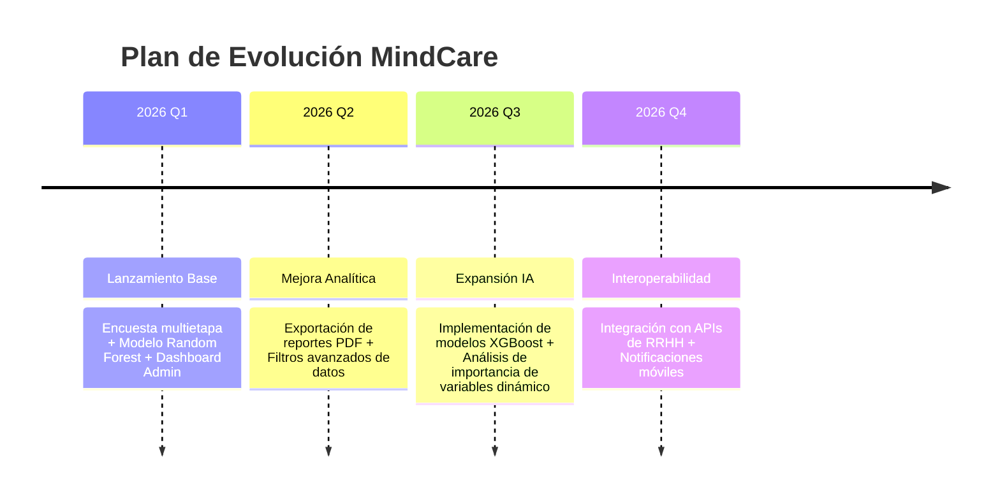

# IEEE 1016 - 18. Roadmap y Futuro del Proyecto

## 18.1 Visión a Largo Plazo
MindCare aspira a convertirse en el estándar de oro para la detección temprana de riesgos psicosociales en entornos corporativos de alta presión.

## 18.2 Hoja de Ruta (Roadmap)

## 18.3 Mejoras Técnicas Identificadas
- **Migración a PostgreSQL**: Para soportar mayor concurrencia en entornos corporativos masivos.
- **Dockerización**: Crear contenedores para facilitar el despliegue en cualquier infraestructura cloud (AWS, Azure, GCP).
- **Internacionalización (i18n)**: Soporte para múltiples idiomas (Inglés, Portugués) para escalabilidad global.

## 18.4 Conclusión del Diseño
La arquitectura actual es robusta y flexible, permitiendo que todas estas mejoras se integren sin necesidad de refactorizaciones profundas, cumpliendo así con los principios de **ingeniería de software sostenible**.
