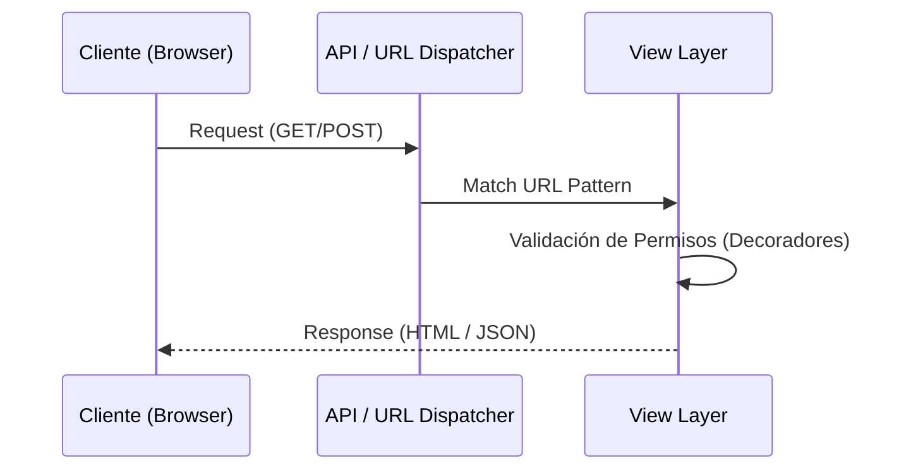

# IEEE 1016 - 19. Referencia Detallada de la API

## 19.1 Arquitectura de Endpoints
MindCare utiliza una estructura de URLs semánticas para la comunicación interna y posibles integraciones futuras.

## 19.2 Catálogo de Endpoints

### 1. Gestión de Sesiones
| Método | Endpoint | Acción | Acceso |
| :--- | :--- | :--- | :--- |
| `POST` | `/login/` | Autentica al usuario y crea sesión. | Público |
| `POST` | `/logout/` | Cierra la sesión activa. | Autenticado |
| `POST` | `/register/` | Crea un nuevo perfil de usuario. | Público |

### 2. Motor de Encuestas y IA
| Método | Endpoint | Acción | Acceso |
| :--- | :--- | :--- | :--- |
| `GET/POST`| `/survey/` | Renderiza y procesa la encuesta. | Estándar |
| `GET` | `/results/<id>/`| Recupera el diagnóstico de una evaluación. | Propietario/Admin |
| `GET` | `/history/` | Lista las evaluaciones pasadas. | Propietario |

### 3. Administración (AJAX/Vistas)
| Método | Endpoint | Acción | Acceso |
| :--- | :--- | :--- | :--- |
| `GET` | `/users/` | Lista usuarios registrados. | Superuser |
| `POST` | `/users/toggle-role/<id>/` | Cambia rol vía AJAX (JSON). | Superuser |

## 19.3 Formato de Respuesta AJAX (Toggle Role)
```json
{
    "success": true,
    "is_superuser": true,
    "username": "nombre_usuario"
}
```

## 19.4 Diagrama de Flujo de API


