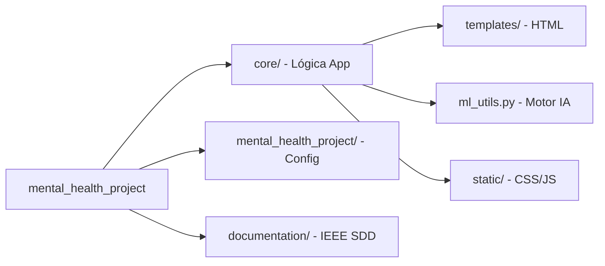

# IEEE 1016 - 20. Manual de Instalación Técnica (DevOps)

## 20.1 Prerrequisitos del Entorno
Para el despliegue correcto de MindCare, el entorno debe contar con:
- **Python 3.10+**
- **pip** (Administrador de paquetes)
- **Git** (Para control de versiones)

## 20.2 Pasos de Instalación (Clean Install)

### 1. Clonación del Repositorio
```bash
git clone <url-del-repositorio>
cd mental_health_project
```

### 2. Creación de Entorno Virtual
```bash
python -m venv venv
source venv/bin/activate  # En Windows: venv\Scripts\activate
```

### 3. Instalación de Dependencias
```bash
pip install -r requirements.txt
```

### 4. Configuración de Base de Datos
```bash
python manage.py makemigrations
python manage.py migrate
```

### 5. Creación de Superusuario (Administrador)
```bash
python manage.py createsuperuser
```

### 6. Ejecución del Servidor de Desarrollo
```bash
python manage.py runserver
```

## 20.3 Verificación de la Instalación
Acceda a `http://127.0.0.1:8000/` y verifique que la página de inicio cargue correctamente. Pruebe el acceso al administrador en `http://127.0.0.1:8000/admin/`.

## 20.4 Árbol de Directorios (Mapeo Técnico)


