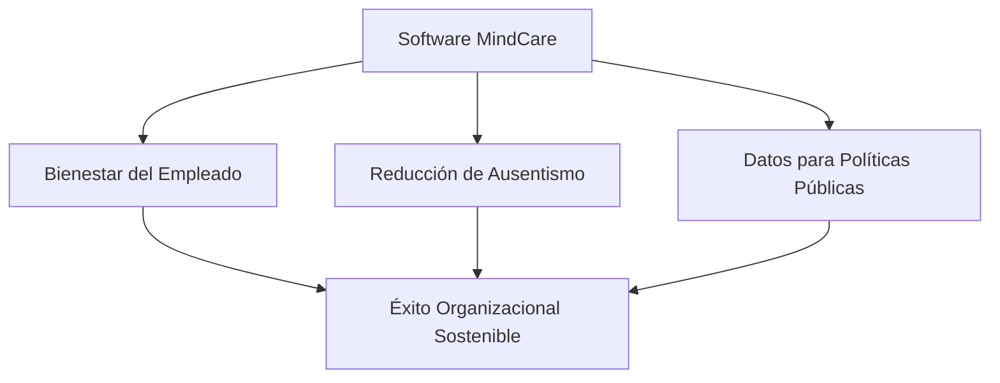

# IEEE 1016 - 21. Sostenibilidad e Impacto Social

## 21.1 Compromiso con la Salud Mental
MindCare no es solo un software; es una intervención tecnológica diseñada para reducir la brecha de atención en salud mental comunitaria y corporativa.

## 21.2 Impacto Social Esperado
- **Detección Temprana**: Reducción en los tiempos de identificación de riesgos psicosociales.
- **Desestigmatización**: Al ser una herramienta privada y digital, reduce la barrera psicológica de buscar ayuda inicial.
- **Acceso Democrático**: Proporciona herramientas de alto nivel a organizaciones con recursos limitados para servicios de psiquiatría in-situ.

## 21.3 Sostenibilidad Técnica (Green Coding)
- **Eficiencia del Algoritmo**: El uso de Random Forest es energéticamente más eficiente que las redes neuronales profundas (Deep Learning) para este tipo de datos.
- **Arquitectura Ligera**: La optimización de consultas ORM reduce el consumo de CPU y memoria en el servidor, disminuyendo la huella de carbono digital del proyecto.

## 21.4 Modelo de Valor del Proyecto

## 21.5 Escalabilidad Regional
El diseño soporta la adaptación a diferentes contextos culturales mediante la actualización del set de entrenamiento de la IA con datos específicos de cada región o país.
