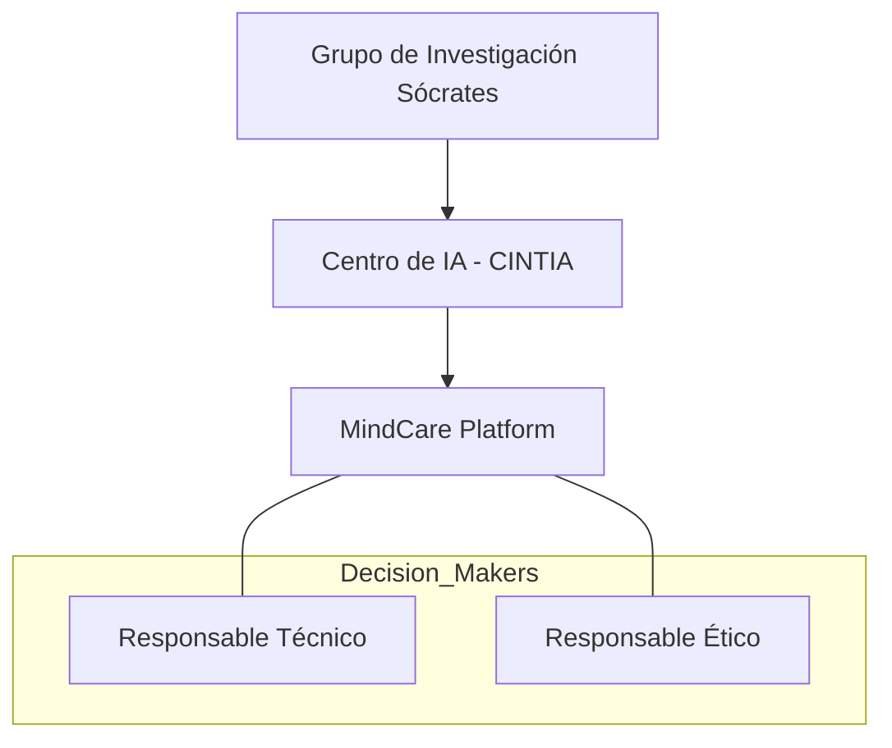

# IEEE 1016 - 22. Modelo de Gobierno y Licenciamiento

## 22.1 Gobernanza del Proyecto
Define quién toma las decisiones técnicas y cómo se gestiona la evolución de MindCare dentro del **Grupo Sócrates**.

- **Director Técnico**: Supervisa la integridad del modelo de IA y la arquitectura core.
- **Comité de Ética**: Revisa trimestralmente que las predicciones no infrinjan derechos humanos.
- **Líder de Desarrollo**: Gestiona el ciclo de vida de los parches y el control de versiones.

## 22.2 Propiedad Intelectual
Todos los algoritmos, esquemas de bases de datos y códigos fuente desarrollados en este repositorio son propiedad del equipo de investigación, protegidos bajo leyes de propiedad intelectual científica.

## 22.3 Licenciamiento Propuesto
El proyecto se rige (o se regirá) bajo una licencia que permite el uso académico e institucional sin fines de lucro, reservando los derechos para implementaciones comerciales masivas.

## 22.4 Diagrama de Gobernanza

## 22.5 Cumplimiento Normativo (Compliance)
MindCare se diseña con la visión de cumplir con estándares internacionales como el GDPR (Europa) y leyes locales de protección de datos personales, asegurando que la soberanía de los datos pertenezca siempre al titular de la información.
