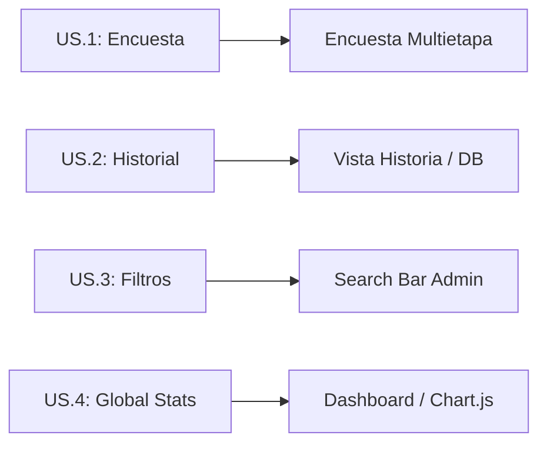

# IEEE 1016 - 23. Historias de Usuario y Criterios de Aceptación (User Stories)

## 23.1 Metodología
Las funcionalidades de MindCare se definen desde la perspectiva del valor para el usuario final, siguiendo el formato estándar de historias de usuario.

## 23.2 Historias de Usuario Clave

| ID | Rol | Acción | Resultado / Valor |
| :--- | :--- | :--- | :--- |
| **US.1** | Usuario | Realizar encuesta anónima | Obtener una recomendación de IA para su salud mental. |
| **US.2** | Usuario | Consultar historial | Ver la evolución de sus resultados a través del tiempo. |
| **US.3** | Administrador | Filtrar usuarios por rol | Identificar rápidamente quiénes tienen privilegios elevados. |
| **US.4** | Administrador | Ver estadísticas globales | Entender el estado general de salud de la población evaluada. |

## 23.3 Criterios de Aceptación (Ejemplo US.1)
1. El usuario debe poder navegar por las 16 preguntas sin errores.
2. Cada pregunta debe mostrar su ayuda contextual correspondiente.
3. Al finalizar, el sistema debe procesar los datos en el modelo ML y mostrar el resultado en menos de 2 segundos.
4. El resultado debe ser guardado automáticamente en la base de datos vinculado al ID del usuario.

## 23.4 Mapeo de Historias a Funcionalidad

