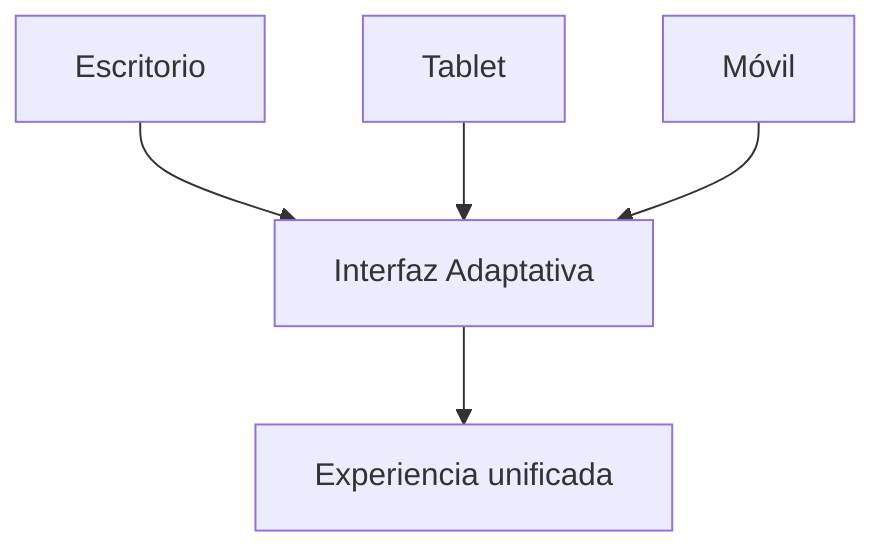

# IEEE 1016 - 24. Diseño de Accesibilidad y Diversidad (WCAG)

## 24.1 Compromiso de Inclusión
MindCare se diseña bajo principios de accesibilidad universal, asegurando que personas con diferentes capacidades puedan utilizar la herramienta de evaluación de salud mental.

## 24.2 Estándares Aplicados (WCAG 2.1)
- **Perceptible**: Uso de contrastes de color altos para legibilidad clara. Soporte para lectores de pantalla mediante etiquetas ARIA.
- **Operable**: Navegación completa por teclado para aquellos que no utilizan ratón.
- **Comprensible**: Lenguaje claro en las preguntas y ayudas contextuales para evitar fatiga cognitiva.
- **Robusto**: Compatibilidad con navegadores modernos y tecnologías de asistencia.

## 24.3 Diseño Multidispositivo (Responsividad)

## 24.4 Consideraciones de Diversidad Lingüística
Aunque la versión base se encuentra en español, la arquitectura está preparada con el sistema de etiquetas de Django (``) para permitir una rápida internacionalización a otros idiomas, respetando las sensibilidades culturales de cada región en temas de salud mental.
