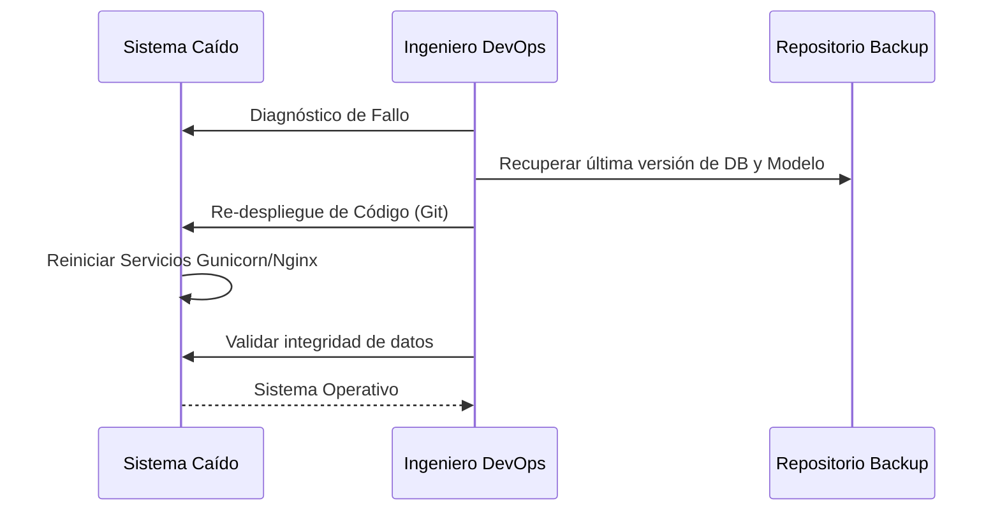

# IEEE 1016 - 25. Recuperación de Desastres y Continuidad

## 25.1 Estrategia de Resiliencia
Define cómo MindCare sobrevive a fallos críticos de infraestructura o errores masivos de datos.

## 25.2 Plan de Copia de Seguridad (Backups)
- **Frecuencia**: Copias diarias del archivo `db.sqlite3`.
- **Almacenamiento**: Las copias deben guardarse en una ubicación física o lógica distinta a la del servidor de producción.
- **Retención**: Se conservan copias de los últimos 30 días.

## 25.3 RTO y RPO (Objetivos de Tiempo y Punto)
- **RTO (Recovery Time Objective)**: Tiempo máximo para restablecer el servicio tras un fallo < 4 horas.
- **RPO (Recovery Point Objective)**: Pérdida máxima aceptable de datos < 24 horas (correspondiente al último backup).

## 25.4 Procedimiento de Recuperación

## 25.5 Continuidad Operativa
En caso de fallo total del servidor, se mantiene una instancia de "solo lectura" o una versión estática de información de contacto de emergencia para que el usuario nunca quede desatendido en una situación de crisis.
