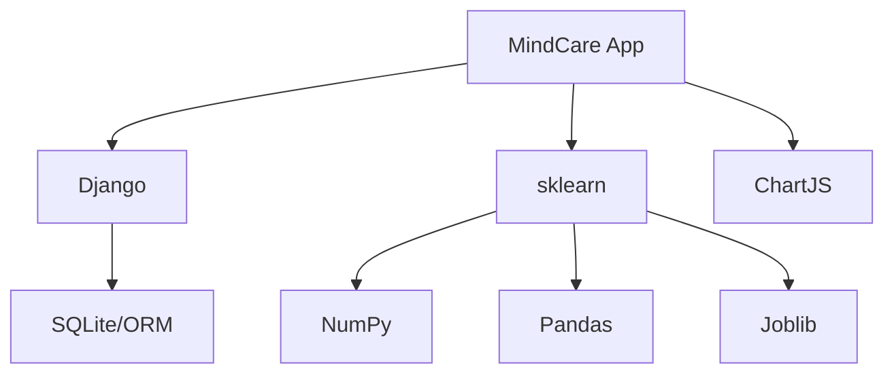

# IEEE 1016 - 26. Inventario de Software (SBOM) y Dependencias

## 26.1 Software Bill of Materials (SBOM)
MindCare se apoya en componentes de código abierto de clase mundial. Esta sección cataloga las dependencias críticas y sus licencias.

## 26.2 Componentes Principales del Backend (Python)

| Componente | Versión | Licencia | Propósito |
| :--- | :--- | :--- | :--- |
| **Django** | 6.x | BSD-3-Clause| Framework Core y Seguridad. |
| **Scikit-Learn**| 1.x | BSD-3-Clause| Motor de Machine Learning. |
| **Pandas / NumPy**| 2.x | BSD-3-Clause| Manipulación de datos numéricos. |
| **Joblib** | 1.x | BSD-3-Clause| Persistencia del modelo IA. |

## 26.3 Componentes del Frontend

| Componente | Origen | Licencia | Propósito |
| :--- | :--- | :--- | :--- |
| **Chart.js** | MIT | Visualización de gráficos estadísticos. |
| **Mermaid.js** | MIT | Renderizado de diagramas de ingeniería. |
| **Google Fonts**| Apache 2.0 | Tipografías (Inter/Outfit). |

## 26.4 Diagrama de Árbol de Dependencias

## 26.5 Auditoría de Seguridad de Dependencias
Se recomienda el uso periódico de `pip-audit` o herramientas de análisis de vulnerabilidades para asegurar que ninguna dependencia tenga fallos conocidos (CVEs) que pongan en riesgo el sistema.
