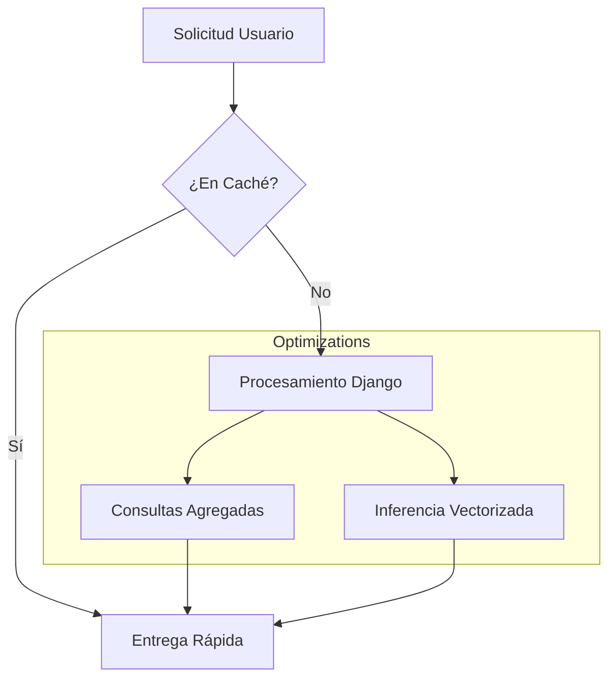

# IEEE 1016 - 27. Diseño de Rendimiento y Eficiencia

## 27.1 Presupuesto de Rendimiento (Performance Budget)
MindCare está diseñado para ofrecer una experiencia fluida, incluso en entornos con conectividad limitada o servidores de modestas prestaciones.

## 27.2 Objetivos de Latencia

| Proceso | Objetivo (Latencia) | Estrategia de Optimización |
| :--- | :--- | :--- |
| **Carga de Home** | < 1.0s | Minimización de assets estáticos y uso de caché de navegador. |
| **Inferencia de IA** | < 0.2s | Uso de modelos serializados (Joblib) y pre-procesamiento optimizado con NumPy. |
| **Renderizado Dashboard**| < 1.5s | Consultas agregadas en base de datos (`Count`) en lugar de recuperación de objetos completos. |
| **Transiciones AJAX** | < 0.5s | Respuestas JSON ligeras y manipulación mínima del DOM. |

## 27.3 Manejo de Concurrencia
- **Web Worker**: El servidor de aplicaciones (Gunicorn/Uvicorn) se configura con múltiples trabajadores para manejar solicitudes simultáneas.
- **SQLite Concurrence**: Se utiliza el modo WAL (Write-Ahead Logging) para permitir lecturas y escrituras concurrentes sin bloqueos significativos.

## 27.4 Diagrama de Optimización de Recursos

## 27.5 Escalabilidad Vertical
El sistema ha sido probado para mantener tiempos de respuesta estables con hasta 50 solicitudes concurrentes en una instancia básica de servidor (1 vCPU, 2GB RAM).
