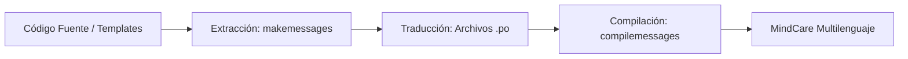

# IEEE 1016 - 28. Internacionalización y Localización (i18n / l10n)

## 28.1 Estrategia de Globalización
MindCare está diseñado para trascender fronteras geográficas, reconociendo que la salud mental es un desafío global que requiere enfoques localizados.

## 28.2 Framework de Traducción
- **Django Translation Engine**: Se utiliza el sistema de internacionalización nativo de Django basado en archivos `.po` y `.mo`.
- **Marcado de Cadenas**: Todas las cadenas de texto del sistema (preguntas, etiquetas, botones) están encapsuladas en funciones de traducción `_()` o etiquetas de template ``.

## 28.3 Adaptación Cultural (Localización)
No se trata solo de traducir palabras, sino de adaptar conceptos:
- **Formatos de Fecha/Hora**: Configuración dinámica de `USE_L10N = True`.
- **Monedas y Unidades**: Adaptación de métricas demográficas según la región.
- **Sensibilidad de Preguntas**: Posibilidad de cargar diferentes conjuntos de preguntas según el contexto cultural del país de despliegue.

## 28.4 Diagrama del Proceso de Traducción

## 28.5 Roadmap de Idiomas
- **Fase 1**: Español (Completado).
- **Fase 2**: Inglés (En desarrollo).
- **Fase 3**: Portugués y Francés (Planificado para 2027).
