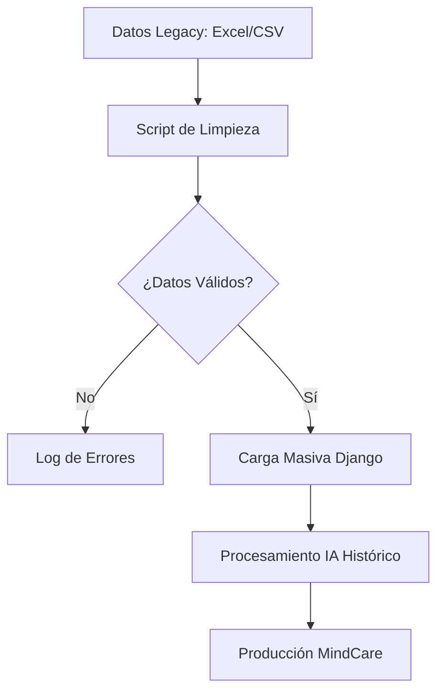

# IEEE 1016 - 29. Estrategia de Migración de Datos y Transición

## 29.1 Escenarios de Migración
MindCare contempla la transición desde sistemas de encuestas manuales (papel/Excel) o desde versiones anteriores del software.

## 29.2 Pipeline de Ingesta de Datos

1.  **Extracción**: Los datos históricos se recolectan en formatos CSV o JSON.
2.  **Limpieza**: Scripts de Python validan que los datos cumplan con las 16 dimensiones requeridas por el modelo de IA.
3.  **Carga (Load)**: Uso de comandos personalizados de Django (`management commands`) para poblar la base de datos SQLite masivamente.
4.  **Inferencia Retroactiva**: Una vez cargados, el sistema puede ejecutar el modelo de IA sobre datos antiguos para generar predicciones históricas ("retro-labeling").

## 29.3 Diagrama del Proceso de Transición

## 29.4 Gestión de Esquemas (Migrations)
El uso de `django-migrations` asegura que cualquier cambio en la estructura de la base de datos (por ejemplo, añadir un nuevo campo a la encuesta) sea rastreable, reversible y consistente en todos los entornos de despliegue.

## 29.5 Plan de Rollback
En caso de fallo durante una migración crítica, el sistema mantiene copias de seguridad de la base de datos previas a la operación para permitir una restauración al estado estable en minutos.
