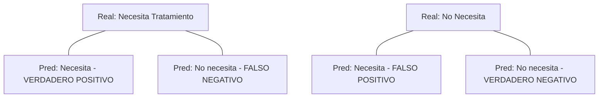

# IEEE 1016 - 30. Métricas de Calidad de Software y KPIs

## 30.1 Indicadores Clave de Desempeño (KPIs)
El éxito técnico y social de MindCare se mide a través de un conjunto de métricas cuantitativas que se monitorean en cada versión.

## 30.2 Métricas de Salud del Software

| Categoría | Métrica | Objetivo | Frecuencia |
| :--- | :--- | :--- | :--- |
| **Estabilidad** | Uptime del Servidor | > 99.5% | Mensual |
| **IA** | Precisión del Modelo (Accuracy) | > 80% | Por versión |
| **Fricción** | Tasa de Abandono de Encuesta | < 15% | Semanal |
| **Calidad** | Cobertura de Código (Unit Tests) | > 70% | Por despliegue |

## 30.3 Métricas de Inferencia IA (Matriz de Confusión)

## 30.4 Evolución de la Calidad (KPI Dashboard)
El sistema permite a los administradores visualizar el crecimiento del volumen de datos y la consistencia de las predicciones, facilitando la identificación de casos donde el modelo necesite ser re-entrenado por cambios en los patrones de comportamiento de los usuarios (Data Drift).

