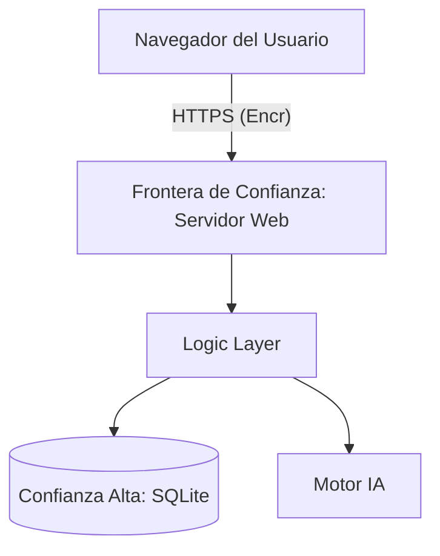

# IEEE 1016 - 32. Modelado de Amenazas y Seguridad Profunda

## 32.1 Metodología STRIDE
Se ha realizado un análisis de seguridad utilizando el framework STRIDE para identificar posibles debilidades en la arquitectura de MindCare.

## 32.2 Análisis de Amenazas

| Categoría STRIDE | Amenaza Potencial | Mitigación Implementada |
| :--- | :--- | :--- |
| **Spoofing** | Suplantación de identidad de administrador. | Hashing de contraseñas PBKDF2 + Validación robusta de sesiones. |
| **Tampering** | Alteración de resultados de la encuesta en tránsito. | Uso obligatorio de TLS/HTTPS y validación de integridad de datos. |
| **Repudiation** | Denegación de haber realizado una encuesta. | Registro de logs de actividad auditables (Audit Logs). |
| **Information Leak** | Exposición de errores de Django en producción. | `DEBUG = False` y gestión de errores personalizada. |
| **DoS** | Saturación de solicitudes de registro falsos. | Implementación de validaciones a nivel de formulario. |
| **Elevation of Privilege**| Acceso de usuario estándar a `/users/edit/`. | Decorador `@user_passes_test` en cada endpoint sensible. |

## 32.3 Diagrama de Flujo de Datos con Límites de Confianza (DFD)

## 32.4 Auditoría de Seguridad Periódica
Se recomienda la ejecución mensual de escaneos de vulnerabilidades utilizando herramientas como **OWASP ZAP** para detectar riesgos emergentes en las bibliotecas de terceros.
