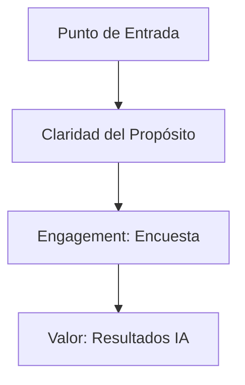

# IEEE 1016 - 33. Investigación UX y Diseño Centrado en el Usuario

## 33.1 Filosofía de Diseño: Empatía Digital
MindCare busca crear una experiencia reconfortante y segura para usuarios que podrían estar bajo estrés mental sustancial.

## 33.2 User Personas (Arquetipos)
1.  **Ana (Empleado Corporativo)**: Preocupada por la privacidad de sus datos pero busca entender sus síntomas.
2.  **Carlos (Gerente de RRHH)**: Necesita entender tendencias grupales sin invadir la privacidad individual.
3.  **Mario (Investigador)**: Busca datos precisos y consistentes para sus estudios de salud laboral.

## 33.3 Diseño Visual y Psicología del Color
- **Paleta de Azules**: Transmite confianza, calma y profesionalismo médico.
- **Tipografía (Inter/Outfit)**: Alta legibilidad para reducir la fatiga visual.
- **Micro-animaciones**: Proporcionan feedback positivo ("recompensa cognitiva") al avanzar en la encuesta.

## 33.4 Arquitectura de la Información y Navegación

## 33.5 Feedback Loop de Usabilidad
El sistema incluye mecanismos indirectos de medición (como el tiempo de respuesta por pregunta) para identificar fricciones en el flujo de usuario y optimizar la redacción de ítems de la encuesta.
