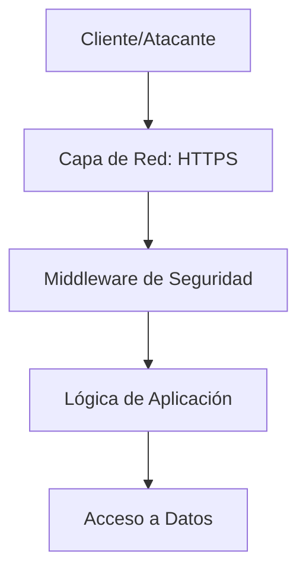

# IEEE 1016 - 34. Seguridad de API y Limitación de Tasa (Rate Limiting)

## 34.1 Protección de Endpoints Expuestos
Aunque MindCare es principalmente una aplicación web, sus rutas funcionan como una API que debe ser protegida contra el abuso y ataques automatizados.

## 34.2 Estrategias de Defensa
1.  **Protección contra Fuerza Bruta**: Límite de intentos de login fallidos por IP (Planificado mediante middleware).
2.  **Mitigación de Scrapping**: Estructura de navegación que dificulta la extracción masiva de datos mediante bots.
3.  **Encabezados de Seguridad (HTTP Headers)**:
    - `X-Frame-Options: DENY` (Previene Clickjacking).
    - `X-Content-Type-Options: nosniff`.
    - `Content-Security-Policy`.

## 34.3 Plan de Limitación de Tasa (Rate Limiting)

| Acción | Límite Sugerido | Propósito |
| :--- | :--- | :--- |
| **Login** | 5 intentos / 5 min | Prevenir cracking de contraseñas. |
| **Envío de Encuesta** | 1 envío / 10 min | Evitar la saturación del motor de IA con datos basura. |
| **Búsqueda Admin** | 30 solicitudes / min | Prevenir la extracción masiva de información de usuarios. |

## 34.4 Diagrama de Seguridad de Capas

## 34.5 Monitoreo de Abuso
El sistema registra patrones de solicitud inusuales en los logs para que el administrador pueda identificar y bloquear rangos de IPs malintencionadas manualmente si es necesario.
