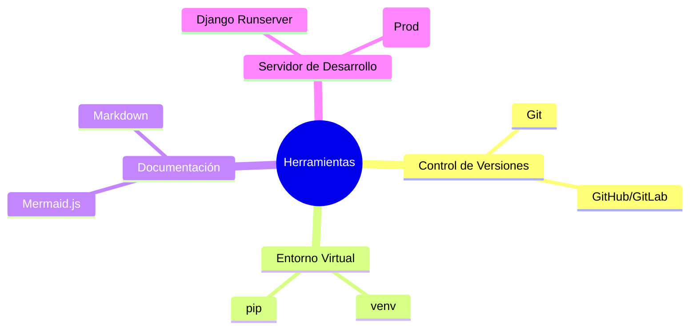

# IEEE 1016 - 35. Herramientas de Desarrollo y Stack Tecnológico Detallado

## 35.1 Ecosistema de Desarrollo
MindCare se construye sobre un stack moderno que equilibra la robustez empresarial con la agilidad de la investigación científica.

## 35.2 Desglose Tecnológico

### Backend (Capa de Poder)
- **Lenguaje**: Python 3.10+ (Tipado dinámico, ecosistema de IA líder).
- **Framework**: Django 6.0 (Arquitectura MVT, seguridad integrada).
- **IA/ML**: Scikit-Learn (Bosques aleatorios), Joblib (Serialización), Pandas (ETL).

### Frontend (Capa de Experiencia)
- **Estructura**: HTML5 Semántico.
- **Estilo**: Vanilla CSS 3 (Flexbox, Grid, Variables CSS).
- **Interactividad**: JavaScript ES6+ (AJAX, Fetch API).
- **Visualización**: Chart.js (Dashboard analítico).

### Base de Datos y Persistencia
- **Motor**: SQLite 3 (Cero-configuración, ideal para investigación y prototipado).
- **Abstracción**: Django ORM (Independencia de motor de DB).

## 35.3 Herramientas de Soporte

## 35.4 Justificación del Stack
La elección de herramientas abiertas y ampliamente documentadas asegura que el proyecto pueda ser mantenido por equipos diversos sin dependencia de licencias propietarias costosas, facilitando su adopción en instituciones públicas y académicas.
