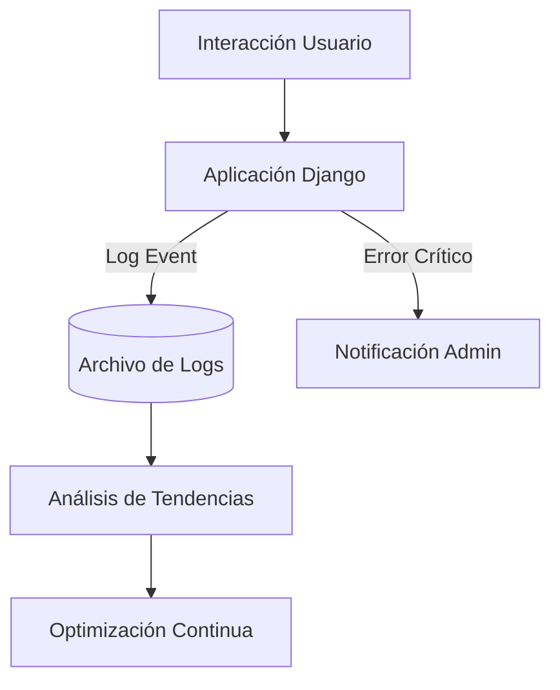

# IEEE 1016 - 36. Estrategia de Monitoreo y Observabilidad

## 36.1 Visibilidad del Sistema
Para garantizar la alta disponibilidad de MindCare, se implementa una estrategia de monitoreo que cubre desde la salud del hardware hasta el rendimiento del modelo de IA.

## 36.2 Niveles de Observabilidad

| Nivel | Métrica Crítica | Herramienta / Método |
| :--- | :--- | :--- |
| **Infraestructura** | Uso de CPU/RAM, Espacio en Disco. | OS Logs / Monitoreo Externo. |
| **Aplicación** | Tiempos de respuesta (Latency), Errores 500/404. | Django Logging (`LOGGING` en settings). |
| **IA (ML)** | Cantidad de predicciones, Inconsistencias. | Logs de auditoría de inferencia. |
| **Usuario** | Tasa de finalización de encuesta. | Analíticas internas de base de datos. |

## 36.3 Gestión de Logs y Alertas

## 36.4 Trazabilidad de Errores
El sistema utiliza el sistema de logging de Django para capturar trazas de errores de Python integrales, facilitando el diagnóstico rápido (Root Cause Analysis) sin exponer información sensible al usuario final en la interfaz.

## 36.5 Monitoreo del Sesgo IA (Model Monitoring)
Se registran las distribuciones de las predicciones para detectar "Concept Drift" (cambios en el patrón de los datos) que pudieran indicar que el modelo necesita un re-entrenamiento urgente para mantener su precisión.
