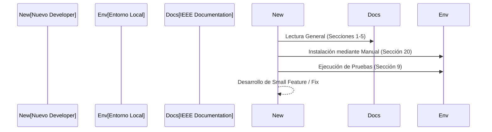

# IEEE 1016 - 37. Plan de Capacitación y Transferencia de Conocimiento

## 37.1 Objetivo de Capacitación
Asegurar que los diferentes perfiles involucrados en MindCare puedan operar, mantener y evolucionar la plataforma de manera autónoma.

## 37.2 Perfiles y Temas de Capacitación

### administradores del Sistema
- **Contenido**: Gestión de usuarios, interpretación del dashboard, manejo de backups y actualizaciones.
- **Formato**: Manual de operación (Sección 14) y talleres prácticos.

### Científicos de Datos / Investigadores
- **Contenido**: Metodología de entrenamiento del Random Forest, actualización de archivos `.joblib` y análisis de métricas de IA.
- **Formato**: Documentación de detalle de IA (Sección 04) y acceso al notebook de entrenamiento original.

### Desarrolladores (Mantenimiento)
- **Contenido**: Arquitectura MVT, flujo de validación de formularios y despliegue técnico.
- **Formato**: Guía de instalación (Sección 20) y revisión del código fuente documentado.

## 37.3 Proceso de Onboarding Técnico

## 37.4 Repositorio de Conocimiento
Toda la ingeniería reside en este hub de documentación bajo el estándar IEEE, garantizando que el "Bus Factor" sea minimizado y el capital intelectual del proyecto permanezca dentro del equipo de investigación.
