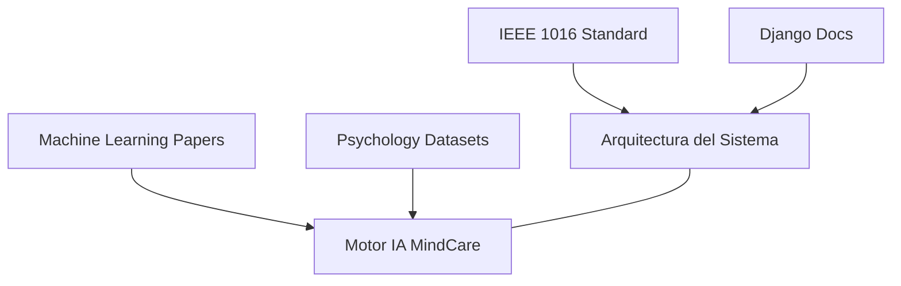

# IEEE 1016 - 38. Bibliografía y Referencias de Investigación

## 38.1 Base Científica de MindCare
El desarrollo de este software no es empírico, sino que se apoya en literatura técnica y académica reconocida en los campos de la computación y la salud mental.

## 38.2 Referencias Clave

### Ingeniería de Software
- **IEEE Std 1016-2009**: Standard for Information Technology - Systems Design - Software Design Descriptions.
- **Django Software Foundation**: Official Documentation for Django Framework 6.0.
- **Gamma, E. et al.**: "Design Patterns: Elements of Reusable Object-Oriented Software".

### Inteligencia Artificial y Salud
- **Pedregosa, F. et al.**: "Scikit-learn: Machine Learning in Python", Journal of Machine Learning Research.
- **Breiman, L.**: "Random Forests", Machine Learning Journal.
- **Dataset**: Mental Health in Tech Survey (Kaggle/Open Sourced), base del entrenamiento inicial del modelo.

## 38.3 Mapa de Influencia Académica

## 38.4 Recursos Adicionales
- **OWASP**: Guías para el desarrollo web seguro.
- **W3C**: Estándares WCAG para la accesibilidad integrada en la herramienta.

