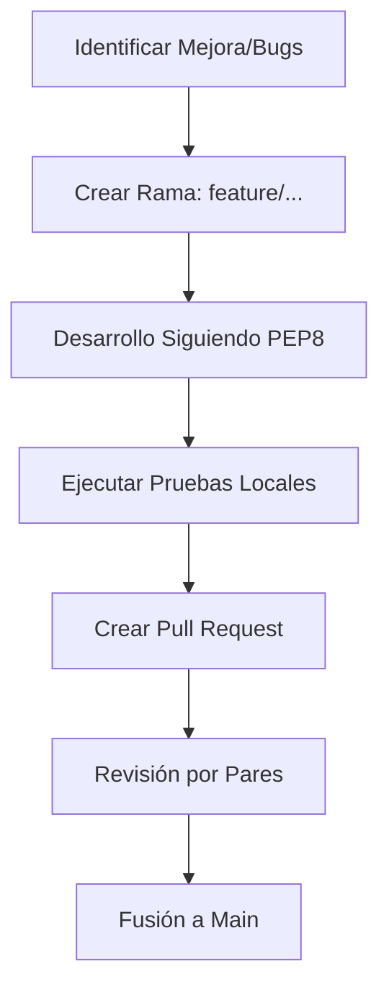

# IEEE 1016 - 39. Código de Conducta y Guías de Contribución

## 39.1 Propósito
MindCare es un proyecto de investigación colaborativa. Estas guías aseguran un entorno de desarrollo profesional, ético e inclusivo para todos los investigadores y desarrolladores.

## 39.2 Código de Conducta
- **Respeto**: Comunicación profesional en todo momento.
- **Integridad Científica**: Prohibida la manipulación de datos o resultados de IA.
- **Inclusión**: Valoración de diversas perspectivas en salud mental y tecnología.
- **Privacidad**: Respeto absoluto por los datos de los usuarios del sistema.

## 39.3 Proceso para Contribuidores

## 39.4 Estándares de Documentación de Código
- Toda nueva función debe incluir un **Docstring** claro.
- Cambios en la arquitectura deben reflejarse inmediatamente en este hub IEEE.
- Se prefiere el uso de comentarios explicativos en bloques de código de lógica compleja (especialmente en `ml_utils.py`).

## 39.5 Comunicación del Equipo
El equipo utiliza canales de comunicación rápidos para discusiones técnicas y reuniones semanales para la revisión de metas de investigación de CINTIA.
