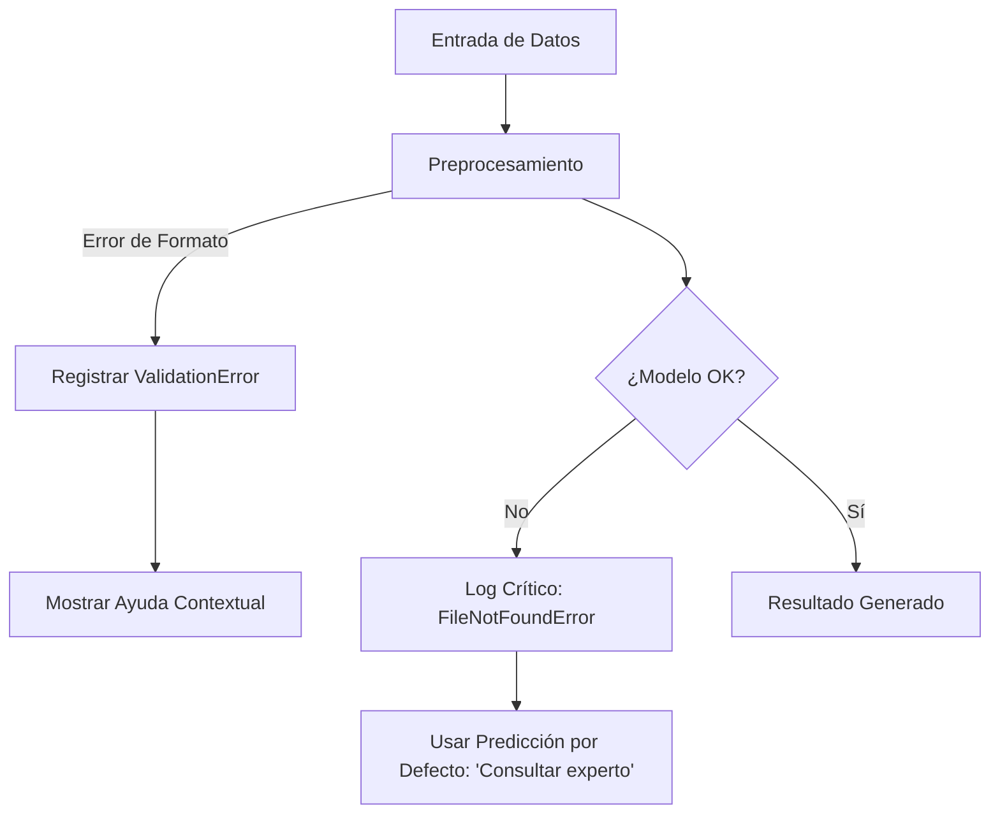

# IEEE 1016 - 40. Gestión de Errores y Excepciones

## 40.1 Filosofía de Manejo de Errores
MindCare utiliza un enfoque de "Falla Segura" (Fail-Safe), donde cualquier error técnico debe ser capturado para evitar la exposición de trazas de código al usuario y garantizar que el servicio de salud mental no se interrumpa abruptamente.

## 40.2 Categorización de Excepciones

| Tipo de Error | Ejemplo | Acción del Sistema | Feedback al Usuario |
| :--- | :--- | :--- | :--- |
| **Validación** | Email mal formado. | Bloqueo en Formulario. | "Por favor, ingrese un correo válido". |
| **Inferencia** | Modelo IA no cargado. | Log de error severo + Fallback. | "Estamos procesando su solicitud, espere". |
| **Persistencia** | Fallo en escritura DB. | Reintento automático / Rollback. | "Hubo un problema al guardar los datos". |
| **Autorización** | Acceso a `/users/` sin ser Admin. | Redirección 403 / Login. | "No tiene permisos para ver esta página". |

## 40.3 Diagrama de Flujo de Excepciones de IA

## 40.4 Centralización de Logs de Error
Todos los errores de nivel `ERROR` y `CRITICAL` se envían a un archivo de logs rotativo para su revisión diaria por parte del equipo de mantenimiento, permitiendo la mejora continua del código.
