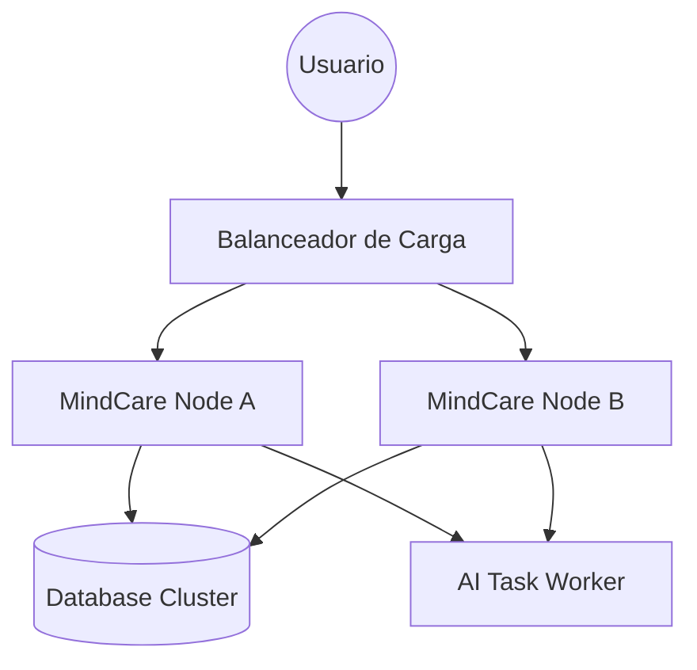

# IEEE 1016 - 41. Estrategia de Escalabilidad y Alta Disponibilidad

## 41.1 Visión de Escalabilidad
MindCare ha sido diseñado considerando un crecimiento potencial desde un grupo piloto de usuarios hasta despliegues masivos en grandes corporaciones o sistemas de salud regionales.

## 41.2 Escalabilidad Vertical y Horizontal

### Escalabilidad Vertical (Upgrade de Servidor)
- Optimización de los trabajadores del servidor Gunicorn para aprovechar múltiples núcleos de CPU.
- Ajuste de límites de memoria para el procesamiento de modelos de IA de mayor tamaño (XGBoost/Ensembles).

### Escalabilidad Horizontal (Balanceo de Carga)
- **Capa Web**: Capacidad de desplegar múltiples instancias de la aplicación Django detrás de un balanceador de carga (Nginx/HAProxy).
- **Capa de IA**: Separación de las inferencias pesadas a trabajadores asíncronos (Celery/Redis) si el volumen de encuestas supera las 100/minuto.

## 41.3 Diagrama de Arquitectura Escalable (Futura)

## 41.4 Alta Disponibilidad (High Availability)
- **Sesiones en Caché**: Uso de Redis para compartir estados de sesión entre múltiples nodos de servidor.
- **Redundancia de Datos**: Plan de migración de SQLite a un clúster de base de datos gestionada (PostgreSQL con réplicas de lectura).

## 41.5 Mitigación de Cuellos de Botella
Se han identificado las tareas de preprocesamiento de datos y la generación de gráficos pesados en el dashboard como los puntos de mayor consumo, los cuales se optimizan mediante ejecución en el lado del cliente (Client-side rendering) donde es técnicamente viable.
