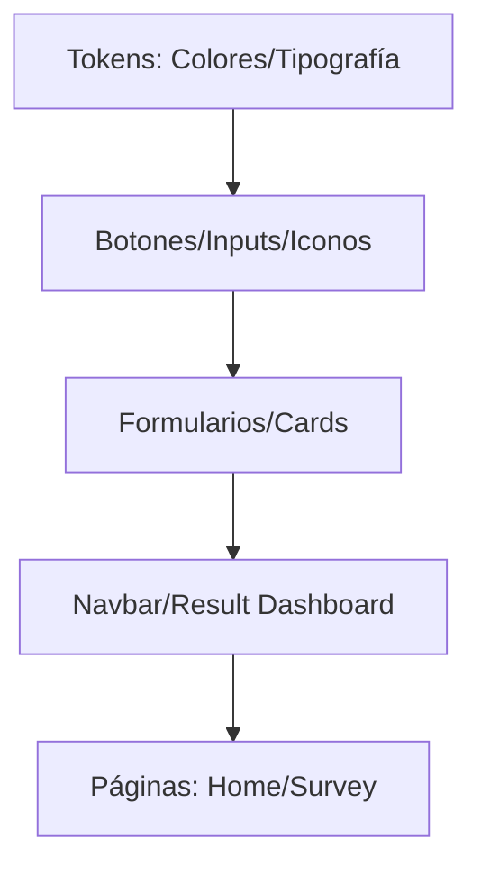

# IEEE 1016 - 42. Sistema de Diseño UX y Tokens Visuales

## 42.1 Diseño Sistemático
MindCare utiliza un sistema de diseño propio para garantizar la coherencia visual y facilitar la escalabilidad del frontend sin duplicación de estilos.

## 42.2 Tokens de Diseño (Variables CSS)

| Token | Valor / Color | Propósito |
| :--- | :--- | :--- |
| `--primary-color` | Azul Profundo / Teal | Identidad, Confianza, Botones Principales. |
| `--secondary-color`| Azul Suave | Calma, Gráficos de soporte, Fondos. |
| `--danger` | Rojo Suave | Errores, Advertencias de Salud. |
| `--success` | Verde Bosque | Confirmaciones, Buenos indicadores. |
| `--shadow` | 0 4px 6px rgba(0,0,0,0.1) | Profundidad y jerarquía visual. |

## 42.3 Biblioteca de Componentes
- **Tarjetas de Autor**: Diseño responsivo con efectos de levitación (Hovers).
- **Steppers de Encuesta**: Indicadores de progreso visual para evitar la saturación del usuario.
- **Badges de Rol**: Etiquetas de color (Admin/Usuario) para identificación instantánea en tablas.
- **Modales de Login/Registro**: Diálogos ligeros que no interrumpen el flujo principal de navegación.

## 42.4 Diagrama del Design System

## 42.5 Adaptabilidad y Accesibilidad Visual
El sistema de diseño ha sido probado para cumplir con el ratio de contraste **AA** (4.5:1) según las normas WCAG, asegurando que el contenido sea legible para usuarios con baja visión o bajo diversas condiciones de iluminación.
