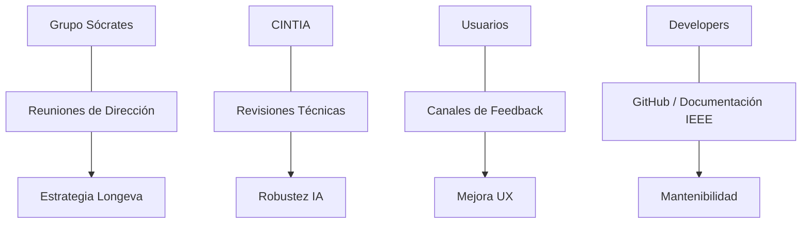

# IEEE 1016 - 43. Gestión de Stakeholders y Actores de Investigación

## 43.1 Identificación de Actores Clave
En un proyecto de salud mental e IA como MindCare, la gestión de los interesados es fundamental para asegurar el éxito ético y técnico del software.

## 43.2 Mapa de Stakeholders (Matriz de Interés/Influencia)

| Stakeholder | Interés | Influencia | Rol en el Proyecto |
| :--- | :--- | :--- | :--- |
| **Grupo Sócrates** | Muy Alto | Alta | Propietarios de la IP y líderes de investigación. |
| **CINTIA** | Alto | Alta | Proveedores de infraestructura y visión de IA. |
| **Usuarios Finales** | Alto | Media | Beneficiarios del diagnóstico y fuentes de datos. |
| **Especialistas en Salud**| Alto | Media | Validadores de la lógica clínica de la encuesta. |
| **Desarrolladores** | Medio | Alta | Ejecutores de la visión técnica y mantenimiento. |

## 43.3 Estrategia de Comunicación

## 43.4 Canales de Colaboración
- **Nivel Estratégico**: Comités mensuales de revisión de avances de CINTIA.
- **Nivel Operativo**: Sprints de desarrollo coordinados mediante herramientas de gestión ágil.
- **Nivel Científico**: Repositorios de datos controlados para el re-entrenamiento del modelo.

## 43.5 Gestión de Expectativas
Se establece claramente que MindCare es una **herramienta de soporte**, no un diagnóstico médico final, alineando las expectativas de todos los interesados con las capacidades reales del modelo de IA implementado.
