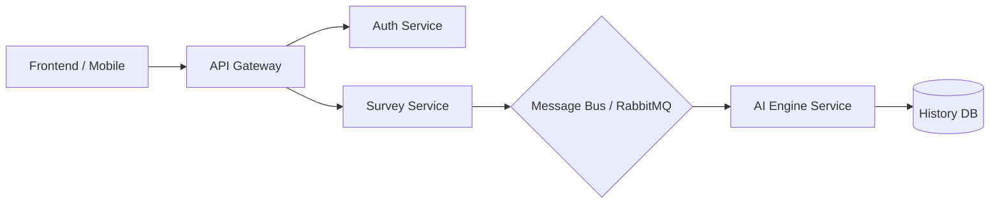

# IEEE 1016 - 44. Visión de Arquitectura de Microservicios (Futura)

## 44.1 Justificación de la Transición
Aunque actualmente MindCare opera como un monolito modular (Django), el crecimiento masivo proyectado sugiere una transición hacia microservicios para permitir el escalado independiente del motor de IA del frontend.

## 44.2 Descomposición de Servicios Propuesta

1.  **Auth Service**: Registro y autenticación centralizada.
2.  **Survey Engine Service**: Gestión de preguntas y recolección de respuestas.
3.  **AI Influx Service**: Motor de inferencia (Random Forest/XGBoost) expuesto vía FastAPI.
4.  **Analytics / Admin Service**: Dashboard y generación de reportes masivos.

## 44.3 Infraestructura de Comunicación (Event-Driven)

## 44.4 Beneficios de esta Visión
- **Políglota**: Posibilidad de escribir el motor de IA en Python especializado y el frontend en tecnologías más rápidas como Go o Node.js.
- **Resiliencia**: Si el motor de IA falla, los usuarios pueden seguir registrándose o consultando el historial previo.
- **Escalado bajo demanda**: Asignar más recursos solo al servicio de IA durante picos de uso (ej. campañas de salud corporativas masivas).

## 44.5 Hoja de Ruta de Transición
Esta transición se planifica como una evolución orgánica, aprovechando la modularidad actual del código de Django para extraer servicios paso a paso sin interrumpir la operación actual.
