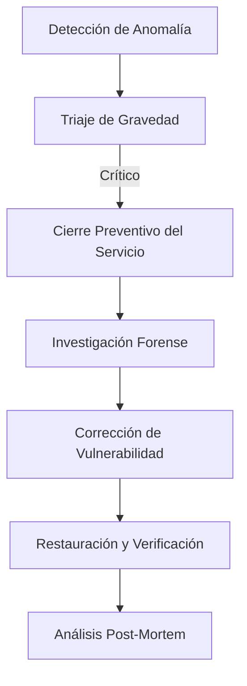

# IEEE 1016 - 45. Plan de Comunicación de Crisis (Técnica)

## 45.1 Propósito
Establecer los protocolos de comunicación y acción ante fallos críticos que afecten la integridad de los datos de salud mental de los usuarios o la disponibilidad total del sistema.

## 45.2 Niveles de Crisis y Respuesta

| Nivel | Descripción | Acción Técnica | Acción de Comunicación |
| :--- | :--- | :--- | :--- |
| **L1 (Bajo)** | Errores visuales menores. | Fix en próximo deploy. | Sin comunicación externa. |
| **L2 (Medio)** | Inferencia de IA lenta. | Escalado de recursos. | Notificación en el Dashboard. |
| **L3 (Alto)** | Base de datos inaccesible. | Restauración de Backup. | Email a usuarios registrados. |
| **CRÍTICO** | Fuga de datos (Breach). | Cierre total / Investigación. | Comunicación legal / Grupos de Interés. |

## 45.3 Flujo de Gestión de Incidentes Críticos

## 45.4 Responsabilidades
- **Responsable de Infraestructura**: Lidera la restauración técnica.
- **Responsable de Privacidad**: Gestiona las implicaciones éticas y legales de la crisis.
- **Portavoz del Grupo Sócrates**: Gestiona la comunicación oficial con el exterior.

## 45.5 Registro de Incidentes (Incident Log)
Toda crisis debe ser documentada detalladamente en un registro interno, especificando la causa raíz, el tiempo de respuesta y las lecciones aprendidas para actualizar la sección de Gestión de Riesgos (Sección 11).
