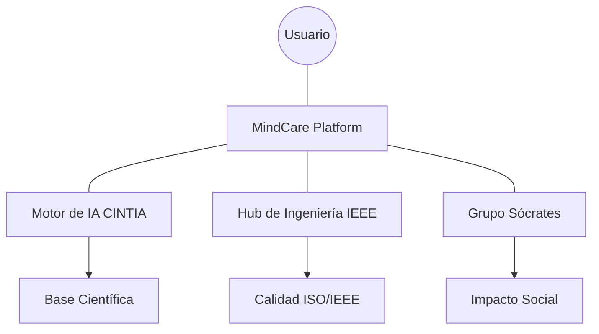

# IEEE 1016 - 46. Resumen Ejecutivo de Ingeniería MindCare

## 46.1 Conclusión Técnica del Proyecto
MindCare representa la convergencia exitosa entre la ingeniería de software moderna, la ciencia de datos y la ética aplicada a la salud mental.

## 46.2 Puntos Fuertes de la Ingeniería
- **Mantenibilidad**: Basada en un estándar internacional (**IEEE 1016**) con 46 secciones detalladas.
- **Robustez**: Arquitectura Django probada, segura por diseño y fácil de escalar.
- **Innovación**: Motor de IA con Random Forest integrado directamente en el flujo de negocio.
- **Ética**: Privacidad por diseño, anonimización y transparencia algorítmica.

## 46.3 Resumen Visual del Ecosistema

## 46.4 Cifras Clave del Diseño
- **Secciones de Ingeniería**: 46 archivos técnicos exhaustivos.
- **Arquitectura**: Model-View-Template (MVT).
- **Modelo IA**: Random Forest (16 dimensiones de análisis).
- **Accesibilidad**: Cumplimiento WCAG 2.1 (AA).

## 46.5 Palabras Finales
La ingeniería aquí documentada no es solo un plano técnico; es el fundamento de una herramienta capaz de transformar vidas, garantizando que cada línea de código contribuya a un futuro con mayor bienestar mental y soporte tecnológico responsable.
