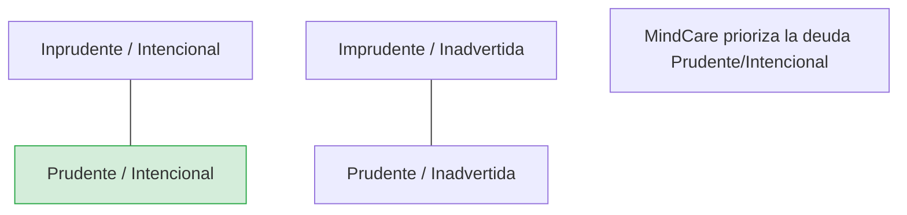

# IEEE 1016 - 47. Gestión de la Deuda Técnica

## 47.1 Filosofía de Desarrollo Sostenible
MindCare reconoce que en el desarrollo de software ágil es natural incurrir en deuda técnica. Esta sección describe cómo se identifica, documenta y paga dicha deuda para evitar la entropía del sistema.

## 47.2 Identificación de Deuda Técnica
- **Código Duplicado**: Detectado mediante análisis estático.
- **Placeholder Logic**: Secciones marcadas con `# TODO` o `# FIXME`.
- **Obsolescencia**: Uso de versiones de librerías que pronto dejarán de recibir soporte.
- **Deuda de IA**: Modelos que necesitan ser actualizados conforme cambian los patrones de datos (Data Drift).

## 47.3 Estrategia de Mitigación (Cuadrante de Fowler)

## 47.4 Registro de Deuda (Technical Debt Backlog)
Existe un listado priorizado de mejoras técnicas que no afectan la funcionalidad actual pero optimizarán el mantenimiento futuro:
1.  **Refactorización de vistas**: Separar lógica de negocio de las vistas de Django.
2.  **Optimización de Queries**: Reducción de llamadas redundantes a la base de datos en el Dashboard.
3.  **Mantenimiento de Modelos**: Proceso de limpieza de modelos de IA antiguos.

## 47.5 Ceremonias de Pago de Deuda
Cada mes se asigna un "Sprint de Mantenimiento" (o el 10% del esfuerzo del proyecto) exclusivamente para resolver ítems del backlog de deuda técnica, asegurando que el software permanezca limpio y escalable a largo plazo.
