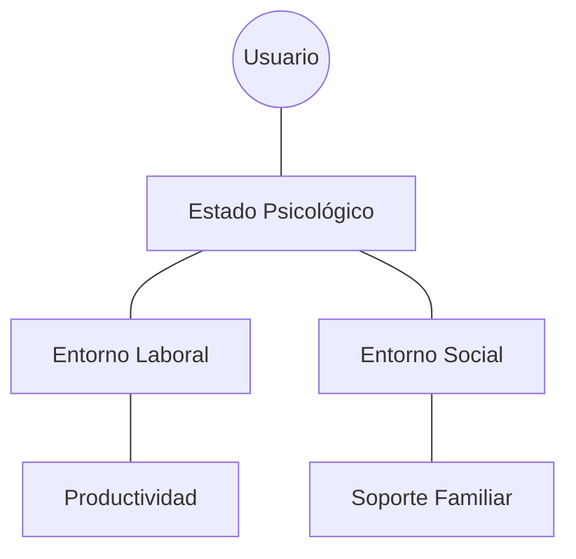

# IEEE 1016 - 49. Glosario de Especialidad en Salud Mental (Dominio)

## 49.1 Propósito
Dada la naturaleza híbrida de MindCare (Psicología + Tecnología), este glosario define los conceptos de dominio de salud mental analizados por el motor de IA.

## 49.2 Conceptos de Salud Mental del Modelo

| Concepto | Definición en el Contexto MindCare |
| :--- | :--- |
| **Interferencia Laboral**| Grado en que la condición mental afecta la productividad o seguridad del individuo. |
| **Historial Familiar** | Antecedentes de salud mental en la familia, variable clave para la predicción de riesgo. |
| **Consecuencias Mentales**| Impacto percibido por el usuario sobre su carrera o relaciones al discutir su salud mental. |
| **Bienestar Psicosocial**| Estado general de balance entre las demandas del entorno y las capacidades del individuo. |
| **Estigma Percibido** | Barrera psicológica que impide al usuario buscar ayuda por miedo al juicio social o laboral. |

## 49.3 Ontología del Dominio

## 49.4 Relevancia para el Entrenamiento de IA
Cada término aquí definido corresponde a una o más variables dentro del conjunto de datos de entrenamiento, asegurando que la IA esté alineada con terminología psicológica profesional y no solo con etiquetas arbitrarias.
