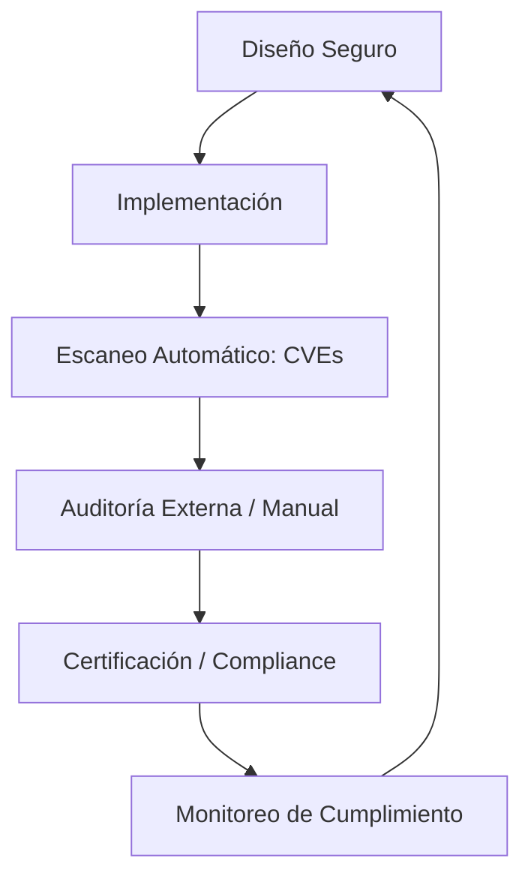

# IEEE 1016 - 50. Certificaciones, Cumplimiento y Auditoría (Compliance)

## 50.1 Marco de Cumplimiento Global
En su sección final, MindCare identifica los estándares de certificación que el software aspira a cumplir para su despliegue en entornos médicos y corporativos internacionales.

## 50.2 Objetivos de Certificación y Cumplimiento

| Estándar | Ámbito | Relevancia para MindCare |
| :--- | :--- | :--- |
| **HIPAA (EE.UU.)** | Salud | Protección de datos de salud identificables. |
| **GDPR (UE)** | Privacidad | Derecho al olvido y consentimiento explícito del usuario. |
| **ISO 27001** | Seguridad | Gestión integral de la seguridad de la información. |
| **ISO 25010** | Calidad | Estándar sobre la calidad del producto de software. |
| **NIST AI RMF** | Ética IA | Marco de gestión de riesgos para sistemas de IA. |

## 50.3 Proceso de Auditoría Continua

