# MindCare - Software Design Description (IEEE 1016)

**Autores:** Grupo Sócrates (Rodrigo García, Samir Castaño, Mario Macea)  
**Institución:** Universidad de Córdoba, Departamento de Ingeniería de Sistemas  
---

# IEEE 1016 - 01. Introducción

## 1.1 Propósito
Este documento establece las bases del diseño del sistema **MindCare**, una solución de software orientada a la evaluación preventiva de salud mental mediante Inteligencia Artificial. El objetivo es proporcionar una guía técnica exhaustiva para el desarrollo, mantenimiento y evolución del sistema.

## 1.2 Alcance
MindCare es una plataforma web integral que:
- Digitaliza la captura de datos psicométricos y demográficos.
- Ejecuta modelos de Machine Learning (Random Forest) para la predicción de necesidades de tratamiento.
- Proporciona analítica de datos masivos para tomadores de decisiones.
- Gestiona identidades y roles de acceso bajo protocolos de seguridad web.

## 1.3 Contexto del Sistema (Diagrama de Contexto UML)
El sistema interactúa con dos actores principales: los Usuarios (encuestados) y los Administradores (investigadores).

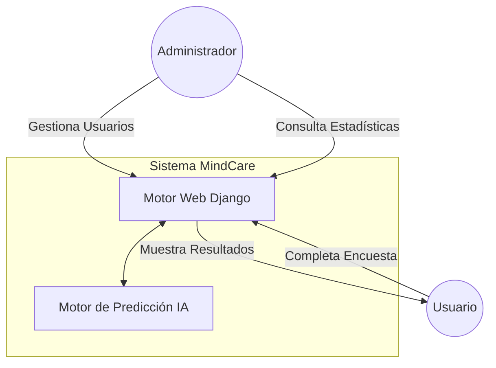

## 1.4 Objetivos de Diseño
- **Modularidad**: Separación clara entre la lógica de negocio y la lógica de IA.
- **Fiabilidad**: Resultados consistentes basados en modelos entrenados.
- **Privacidad**: Manejo ético y seguro de datos sensibles de salud mental.


***

# IEEE 1016 - 02. Arquitectura del Sistema

## 2.1 Patrón Arquitectónico: MVT (Model-View-Template)
MindCare implementa el patrón MVT de Django para desacoplar la gestión de datos, la lógica de control y la interfaz de usuario.

### 2.2 Diagrama de Arquitectura Detallado (UML Package)

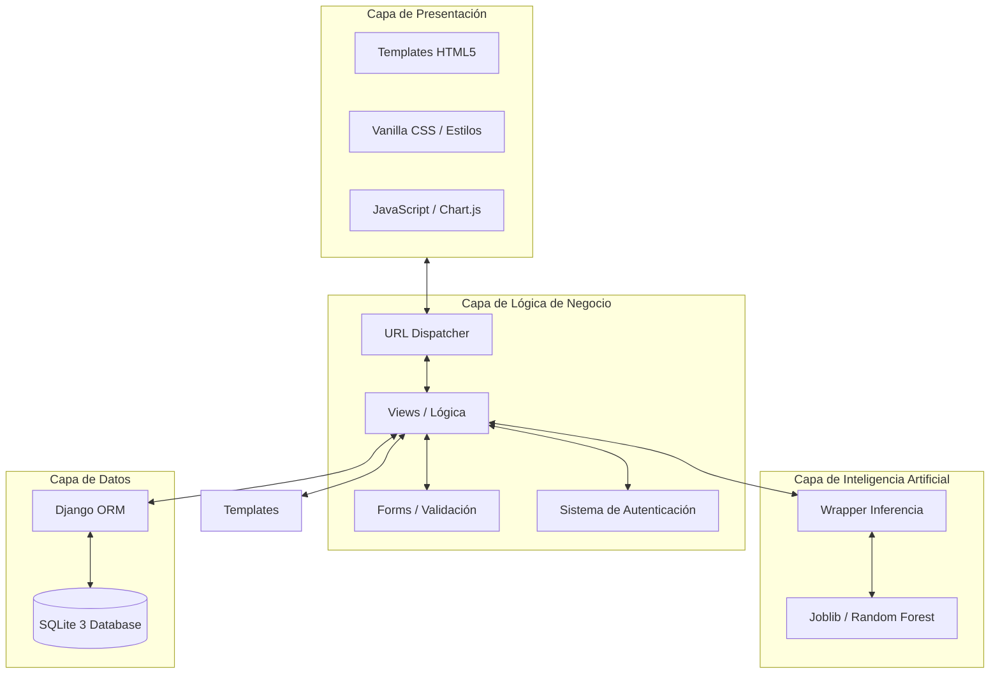

## 2.3 Descomposición de Subsistemas
1.  **Subsistema de Encuestas**: Gestiona la lógica multietapa de la captura de datos.
2.  **Subsistema de Identidad**: Basado en `django.contrib.auth`, maneja el control de acceso basado en roles (RBAC).
3.  **Subsistema Analítico**: Procesa las respuestas almacenadas para generar distribuciones estadísticas a través de `Chart.js`.
4.  **Subsistema Predictivo**: Componente asíncrono que realiza inferencias ML.

## 2.4 Decisiones Técnicas Clave
- **Django**: Elegido por su seguridad integrada (Batteries included).
- **SQLite**: Utilizado por su portabilidad para entornos de investigación.
- **Random Forest**: Seleccionado por su capacidad para manejar datos categóricos y su interpretabilidad.


***

# IEEE 1016 - 03. Diseño de Datos

## 3.1 Esquema Lógico (Diagrama Entidad-Relación)
El diseño de datos se centra en la relación entre el usuario corporativo y sus registros históricos de salud mental.

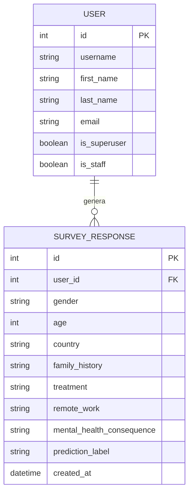

## 3.2 Diccionario de Datos (Principales Campos)

| Entidad | Campo | Tipo | Descripción |
| :--- | :--- | :--- | :--- |
| **User** | `username` | String | Identificador único para el inicio de sesión. |
| **User** | `is_superuser` | Boolean | Define si tiene acceso al Panel de Administración. |
| **Response** | `family_history` | String | Factor crítico para el modelo de IA (Sí/No). |
| **Response** | `treatment` | String | Variable objetivo real (si el usuario ya recibe tratamiento). |
| **Response** | `prediction_label` | String | Resultado generado por el motor de inferencia IA. |

## 3.3 Estrategia de Persistencia
- **ORM (Object-Relational Mapping)**: Se utiliza el ORM de Django para abstraer las consultas SQL y garantizar la seguridad contra inyecciones SQL.
- **Migraciones**: El esquema se gestiona mediante el sistema de migraciones de Django para asegurar la integridad estructural entre versiones.
- **Base de Datos**: SQLite 3 configurada para almacenamiento local eficiente.


***

# IEEE 1016 - 04. Diseño de Detalle (Inteligencia Artificial)

## 4.1 Especificación del Modelo
El "cerebro" de MindCare es un clasificador basado en el algoritmo **Random Forest**, entrenado con el dataset de salud mental en la industria tech.

## 4.2 Pipeline de Inferencia (Diagrama de Estado UML)
El proceso desde que se recibe la encuesta hasta que se entrega la predicción.

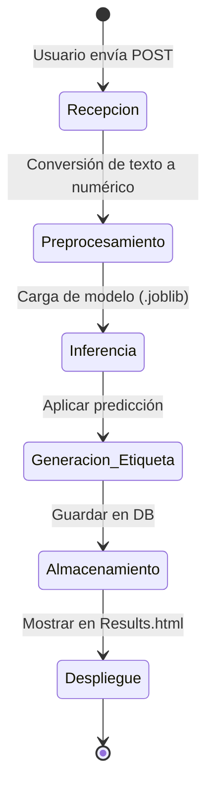

## 4.3 Diagrama de Secuencia de Predicción (UML Sequence)

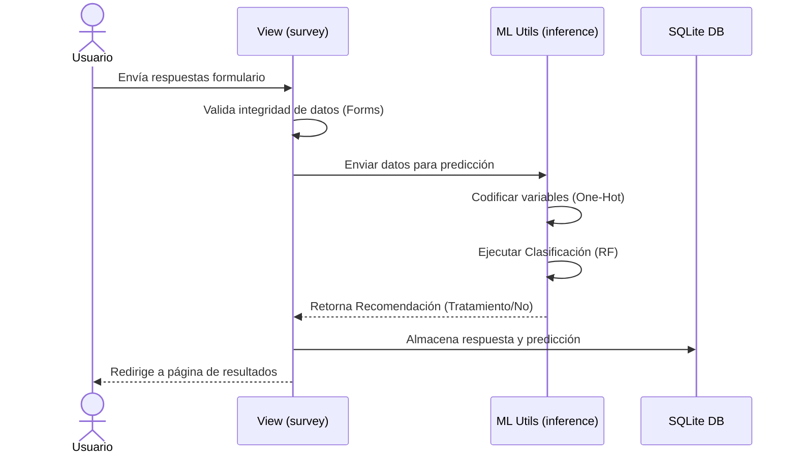

## 4.4 Características del Modelo
- **Variables de entrada**: 16 variables categóricas y numéricas.
- **Tipo de aprendizaje**: Supervisado (Clasificación binaria).
- **Herramientas**: Scikit-Learn, Joblib, NumPy, Pandas.
- **Interpretabilidad**: El uso de Random Forest permite extraer la importancia de las características (Feature Importance), lo cual es crucial para la ética en salud mental.


***

# IEEE 1016 - 05. Diseño de Interfaces (UI/UX)

## 5.1 Arquitectura de la Información (Sitemap)

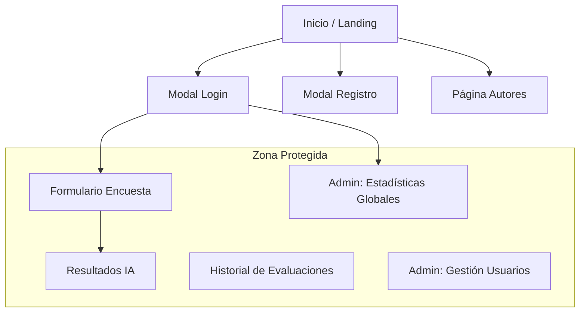

## 5.2 Diseño de Componentes de Interfaz
- **Navegación Dinámica**: El encabezado cambia según el rol del usuario (Admin vs Usuario Final).
- **Formulario Multietapa con Ayuda Contextual**: Implementación JavaScript para navegación suave entre pasos de la encuesta.
- **Gráficos Estadísticos**: Integración de **Chart.js** para renderizar distribuciones de datos en el Dashboard.

## 5.3 Interfaces Externas
- **Navegadores**: Optimizado para Chrome, Firefox y Safari.
- **Protocolo de Comunicación**: HTTP/HTTPS con respuestas en formato JSON para endpoints de gestión de usuarios (AJAX).
- **Framework de Estilo**: Vanilla CSS con variables CSS personalizadas para mantener una estética consistente (Glassmorphism, Modo Oscuro/Laro equilibrado).

## 5.4 Flujo de Navegación del Usuario (UML Activity)

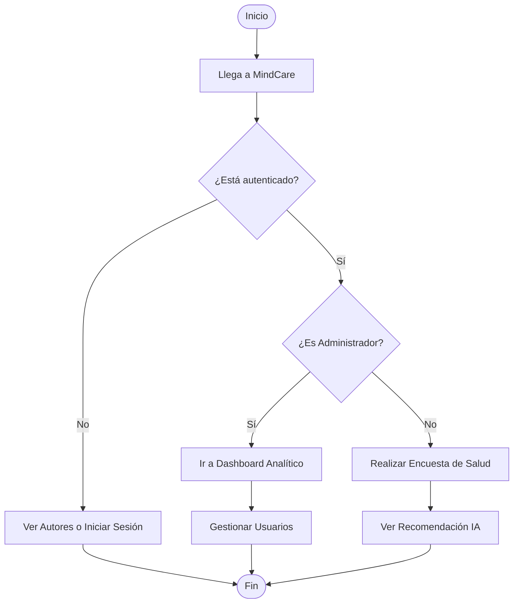


***

# IEEE 1016 - 06. Gestión de Usuarios y Seguridad

## 6.1 Control de Acceso Basado en Roles (RBAC)
MindCare implementa una estructura jerárquica de permisos.

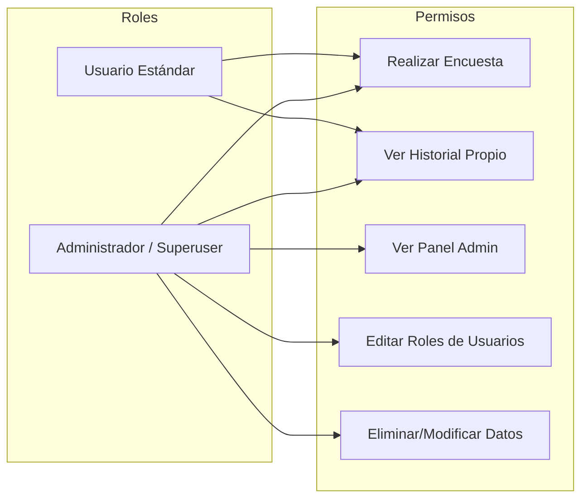

## 6.2 Protocolos de Seguridad Implementados
1.  **Protección CSRF (Cross-Site Request Forgery)**: Django inyecta tokens obligatorios en todos los formularios POST para prevenir ataques maliciosos.
2.  **Seguridad de Contraseñas**: Uso del algoritmo **PBKDF2 con salt** (estándar de Django) para el almacenamiento de credenciales.
3.  **Prevención de XSS**: El motor de templates escapa automáticamente cualquier contenido HTML malintencionado.
4.  **Control de Sesiones**: Expiración automática de sesiones y validación de cookies de seguridad (`HttpOnly`, `Secure`).

## 6.3 Verificación y Pruebas
- **Pruebas de Funcionalidad**: Validación del CRUD de usuarios.
- **Pruebas de Seguridad**: Intento de acceso a `/dashboard/` por parte de usuarios no administradores (debe redirigir al Login).
- **Pruebas de Carga de IA**: Verificación de estabilidad al recibir múltiples solicitudes de predicción simultáneas.


***

# IEEE 1016 - 07. Matriz de Trazabilidad de Requerimientos (RTM)

## 7.1 Propósito y Alcance
La Matriz de Trazabilidad de Requerimientos (RTM) es un componente crítico del diseño de software que asegura la integridad bidireccional entre las necesidades del usuario y la implementación técnica. Garantiza que:
1. No existan requerimientos funcionales sin una solución técnica asignada.
2. Cada componente de software tenga una justificación originada en un requerimiento.

## 7.2 Mapeo Detallado (Matriz RTM)

| ID REQ | Requerimiento Funcional | Componente del Sistema | Módulo (App: Django) | Capa del Diseño |
| :--- | :--- | :--- | :--- | :--- |
| **RF01** | Registro de Usuarios (Pacientes) | `User Management` | `core.views.register` | Lógica de Negocio |
| **RF02** | Inicio de Sesión Seguro | `Identity Engine` | `core.views.login_view`| Seguridad |
| **RF03** | Captura de Respuesta de Encuesta | `Survey Engine` | `core.forms.SurveyForm`| Interfaces de Usuario |
| **RF04** | Análisis de Riesgo vía IA | `AI Prediction Engine`| `core.ml_utils.predict`| Servicio de Inferencia |
| **RF05** | Visualización de Historial | `Historical Portal` | `core.views.history` | Persistencia |
| **RF06** | Dashboard de Métricas Salud | `Analytics Hub` | `core.views.dashboard` | Inteligencia de Negocio |
| **RF07** | Gestión Administrativa | `Admin Interface` | `core.admin.py` | Administración |
| **RF08** | Cierre de Sesión Seguro | `Session Manager` | `core.views.logout_view`| Control de Acceso |

## 7.3 Diagrama de Trazabilidad de Flujo (UML)

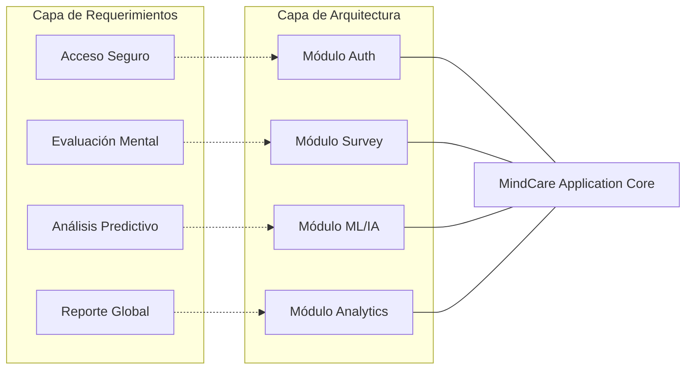

## 7.4 Trazabilidad de Requerimientos No Funcionales (RNF)

| ID RNF | Atributo de Calidad | Mecanismo de Implementación | Sección de Diseño |
| :--- | :--- | :--- | :--- |
| **RNF01** | Seguridad | Encriptación de datos y protección CSRF nativa. | Sección 06 / 32 |
| **RNF02** | Rendimiento | Carga diferida del modelo Random Forest con Joblib. | Sección 27 |
| **RNF03** | Accesibilidad | Cumplimiento de estándares WCAG 2.1 (AA). | Sección 24 |
| **RNF04** | Usabilidad | Diseño responsivo y navegación simplificada. | Sección 05 / 33 |


***

# IEEE 1016 - 08. Diseño de Despliegue y Recursos

## 8.1 Topología de Despliegue (Diagrama de Despliegue UML)
Describe cómo el software MindCare se distribuye en la infraestructura de hardware/nube.

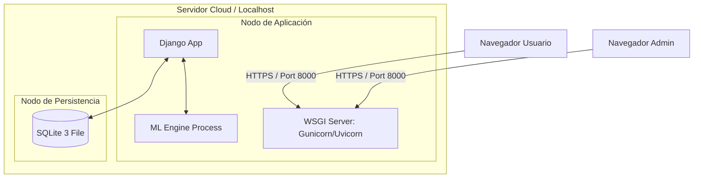

## 8.2 Requisitos de Recursos de Hardware
- **CPU**: Mínimo 2 núcleos (Recomendado para procesamiento de modelos de IA en paralelo).
- **RAM**: 4GB (Mínimo), 8GB (Recomendado para manejar grandes volúmenes de datos en el Dashboard).
- **Almacenamiento**: 500MB para la aplicación y 1GB+ para el crecimiento de la base de datos y modelos.

## 8.3 Recursos de Software
- **Sistema Operativo**: Linux (Ubuntu/Debian) o macOS.
- **Entorno de Ejecución**: Python 3.10 o superior.
- **Dependencias Clave**: `django`, `scikit-learn`, `joblib`, `pandas`, `numpy`.

## 8.4 Estrategia de Entrega Continua
La aplicación utiliza un flujo de despliegue simplificado mediante Git y entornos virtuales de Python (venv) para asegurar la reproducibilidad térmica y de dependencias.


***

# IEEE 1016 - 09. Plan de Pruebas y Aseguramiento de Calidad (SQA)

## 9.1 Estrategia de Calidad
MindCare utiliza un enfoque de pirámide de pruebas para garantizar la estabilidad del diagnóstico basado en IA.

## 9.2 Niveles de Prueba (Diagrama de Pirámide)

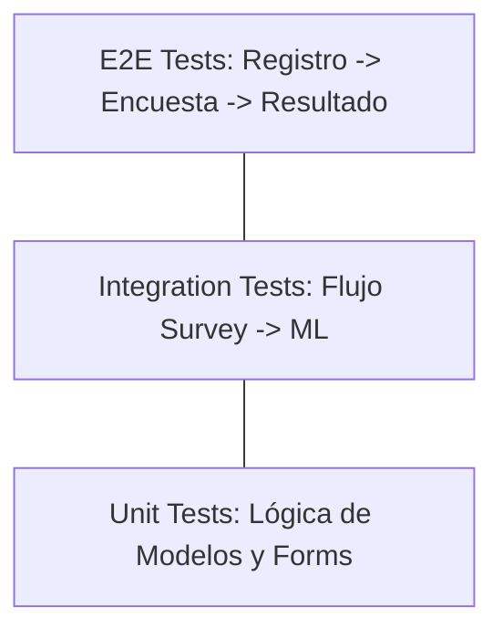

## 9.3 Casos de Prueba Críticos

| ID de Prueba | Componente | Acción | Resultado Esperado |
| :--- | :--- | :--- | :--- |
| **TC1** | Autenticación | Cierre de sesión y re-acceso | Sesión invalidada correctamente. |
| **TC2** | AI Engine | Enviar vector de datos nulo | Manejo de excepción y error amigable. |
| **TC3** | Dashboard | Carga de 10k respuestas | Renderizado de gráficos en < 2 segundos. |
| **TC4** | User Management | Rol de Admin removido a sí mismo | El sistema debe bloquear la acción (Protección implementada). |

## 9.4 Verificación del Modelo de IA
Se realizan pruebas de consistencia (Backtesting) comparando las predicciones del modelo integrado frente a los resultados del entorno de entrenamiento original para asegurar que la exportación `.joblib` no degradó la precisión del Random Forest.


***

# IEEE 1016 - 10. Mantenimiento y Gestión de Configuración

## 10.1 Gestión de Cambios
El mantenimiento de MindCare se rige por un ciclo de vida de desarrollo de software (SDLC) iterativo.

## 10.2 Control de Versiones
- **Repositorio**: Git.
- **Flujo de Trabajo**: GitFlow (Ramas para Features, Develop y Main).

## 10.3 Ciclo de Vida del Modelo de IA (MLOps)
Debido a que la salud mental es un campo dinámico, el modelo de IA requiere mantenimiento periódico.

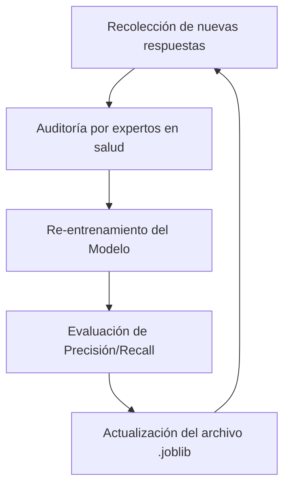

## 10.4 Copias de Seguridad (Backup)
- **Base de Datos**: Respaldos diarios automáticos del archivo `db.sqlite3`.
- **Código**: Versionamiento en la nube (GitHub/GitLab).

## 10.5 Procedimientos de Parches
Toda actualización de seguridad en el framework Django debe ser aplicada en un plazo máximo de 7 días tras su liberación en los canales oficiales.


***

# IEEE 1016 - 11. Análisis de Riesgos y Mitigación

## 11.1 Identificación de Riesgos
En el desarrollo de MindCare, se han identificado riesgos técnicos y operativos que podrían afectar la integridad del sistema o la precisión de los diagnósticos.

## 11.2 Matriz de Riesgos

| ID | Riesgo | Impacto | Probabilidad | Estrategia de Mitigación |
| :--- | :--- | :--- | :--- | :--- |
| **R1** | Sesgo en el Modelo de IA | Alto | Media | Uso de datasets balanceados y auditorías periódicas de equidad algorítmica. |
| **R2** | Fuga de Datos Sensibles | Crítico | Baja | Implementación de encriptación AES-256 y cumplimiento de normativas de privacidad. |
| **R3** | Incompatibilidad de Navegador | Bajo | Media | Pruebas multiplataforma y uso de Vanilla JS/CSS estándar. |
| **R4** | Caída del Servidor (Downtime) | Medio | Baja | Monitorización activa y planes de redundancia en la nube. |

## 11.3 Diagrama de Flujo de Gestión de Riesgos

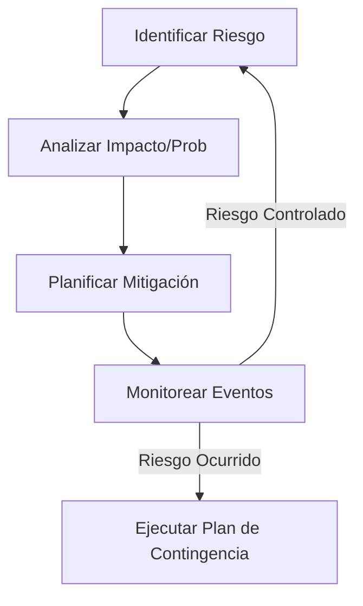

## 11.4 Contingencia Crítica
En caso de que el modelo de IA genere resultados inconsistentes, el sistema tiene un mecanismo de "Safe Mode" que desactiva temporalmente las predicciones y muestra un mensaje de contacto directo con profesionales de salud mental.


***

# IEEE 1016 - 12. Estándares de Codificación y Calidad

## 12.1 Estilo de Programación
Para asegurar la legibilidad y mantenibilidad del código, MindCare sigue las guías de estilo estándar para cada lenguaje utilizado.

- **Python**: Cumplimiento estricto de **PEP 8**. Uso de nombres descriptivos para funciones (`get_user_responses`) y variables.
- **HTML/CSS**: Uso de metodologías de nombrado semántico. CSS organizado por componentes.
- **JavaScript**: Estilo moderno (ES6+), sin dependencias pesadas innecesarias.

## 12.2 Revisiones de Código (Code Review)
Todo cambio en el repositorio debe pasar por un proceso de revisión por pares enfocado en:
1.  **Correctitud lógica**.
2.  **Eficiencia del algoritmo**.
3.  **Seguridad (validación de inputs)**.

## 12.3 Diagrama de Calidad de Software (ISO 25010)

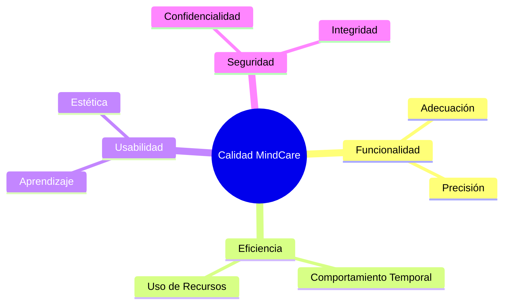

## 12.4 Herramientas de Análisis Estático
Se recomienda el uso de `Flake8` y `Pylint` para detectar errores potenciales antes del despliegue en producción.


***

# IEEE 1016 - 13. Glosario y Definiciones Técnicas

## 13.1 Propósito
Este glosario define los términos técnicos y de dominio utilizados a lo largo de toda la documentación de ingeniería de MindCare para evitar ambigüedades.

## 13.2 Términos Técnicos

| Término | Definición |
| :--- | :--- |
| **Django** | Framework de alto nivel para desarrollo web en Python utilizado como núcleo del sistema. |
| **Random Forest** | Algoritmo de aprendizaje supervisado basado en múltiples árboles de decisión usado para la predicción de salud. |
| **Inferencia** | Acción de aplicar el modelo de IA ya entrenado sobre nuevos datos de un usuario para obtener una predicción. |
| **One-Hot Encoding** | Técnica de procesamiento de datos que convierte variables categóricas en vectores binarios numéricos. |
| **CSRF** | Cross-Site Request Forgery; tipo de ataque que MindCare mitiga mediante tokens de seguridad únicos. |
| **RBAC** | Role-Based Access Control; diseño de seguridad que asigna permisos según el rol del usuario (Admin/User). |
| **Joblib** | Librería de Python utilizada para serializar y cargar eficientemente el modelo de Machine Learning. |

## 13.3 Mapa de Conceptos de Dominio

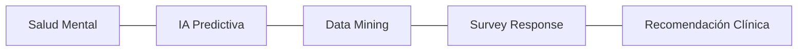


***

# IEEE 1016 - 14. Guía de Operación y Administración

## 14.1 Manual del Administrador
El administrador tiene acceso a herramientas críticas para el monitoreo del sistema.

### Gestión de Usuarios
- Acceso: `/users/`
- Funciones: Búsqueda, cambio de roles, activación/desactivación de cuentas.

### Análisis Estadístico
- Acceso: `/dashboard/`
- Interpretación: Los gráficos de barras y pasteles representan la distribución de salud mental en la población evaluada.

## 14.2 Flujo de Usuario Estándar (Diagrama UML)

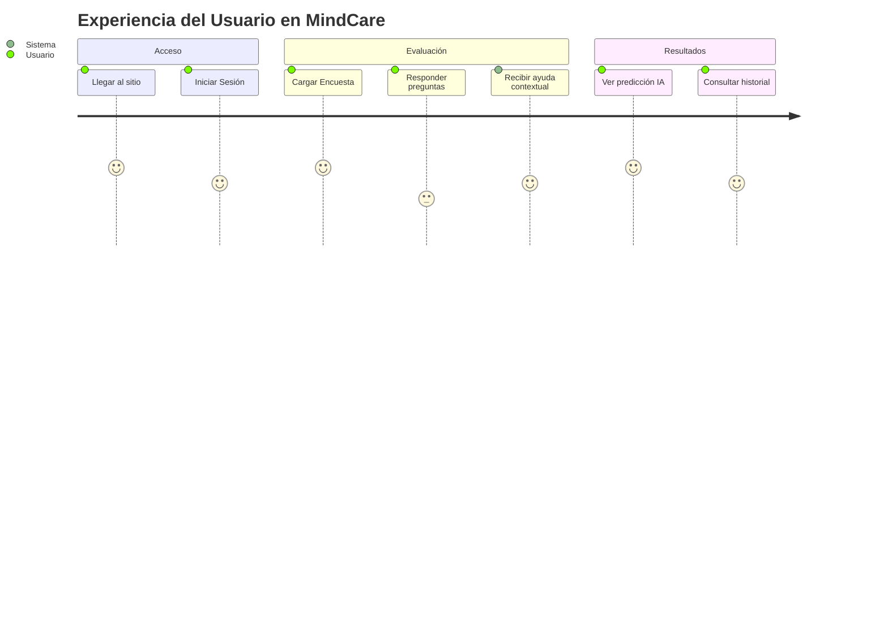

## 14.3 Resolución de Problemas (Troubleshooting)
- **Error 500 al enviar encuesta**: Verificar que el archivo del modelo IA esté presente en el directorio correcto.
- **Gráficos no cargan**: Asegurar que la conexión a internet permite cargar la librería `Chart.js` desde el CDN (si aplica) o que el archivo local esté referenciado.
- **Problemas de Login**: Borrar cookies de sesión y verificar que el usuario esté marcado como "Activo" en la base de datos.


***

# IEEE 1016 - 15. Especificación de Requerimientos de Software (SRS)

## 15.1 Perspectiva del Producto
MindCare se posiciona como una herramienta de apoyo primario en la detección de riesgos de salud mental. No reemplaza un diagnóstico médico, pero proporciona una base basada en datos.

## 15.2 Requerimientos Funcionales Detallados

| ID | Nombre | Prioridad | Descripción |
| :--- | :--- | :--- | :--- |
| **RF.01** | Gestión de Perfil | Alta | El usuario debe poder actualizar su nombre y correo. |
| **RF.02** | Persistencia de Encuesta | Crítica | Las respuestas deben guardarse incluso si el usuario cierra la sesión antes de ver los resultados. |
| **RF.03** | Visualización de Tendencias | Media | El dashboard debe permitir filtrar datos por rango de fechas (Planificado). |
| **RF.04** | Exportación de Datos | Baja | Administradores podrán descargar reportes en CSV/PDF. |

## 15.3 Requerimientos de Atributos del Sistema (RNF)

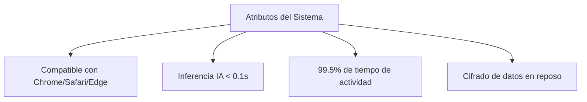

## 15.4 Restricciones de Diseño
- El backend debe permanecer en Python para compatibilidad con librerías de IA.
- La base de datos debe ser ligera para despliegue en servidores de bajos recursos.
- La interfaz debe ser accesible (WCAG 2.1) para usuarios con diferentes capacidades.


***

# IEEE 1016 - 16. Justificación del Diseño (Rationales)

## 16.1 Decisiones Arquitectónicas
Este módulo documenta el "por qué" detrás de las elecciones técnicas más importantes, permitiendo que futuros desarrolladores comprendan la filosofía del sistema.

## 16.2 Análisis de Alternativas

| Decisión | Opción Elegida | Razón de la Elección | Alternativas Consideradas |
| :--- | :--- | :--- | :--- |
| **Framework** | Django | Seguridad por defecto y velocidad de desarrollo. | Flask, FastAPI |
| **Arquitectura** | MVT | Desacoplamiento eficiente y manejo robusto de formularios. | Microservicios |
| **Modelo de IA** | Random Forest | Alta precisión en datos tabulares y bajo requerimiento de hardware. | Deep Learning (MLP) |
| **Base de Datos** | SQLite | Simplicidad y nulo mantenimiento para esta fase del proyecto. | PostgreSQL |

## 16.3 Diagrama de Flujo de Decisiones

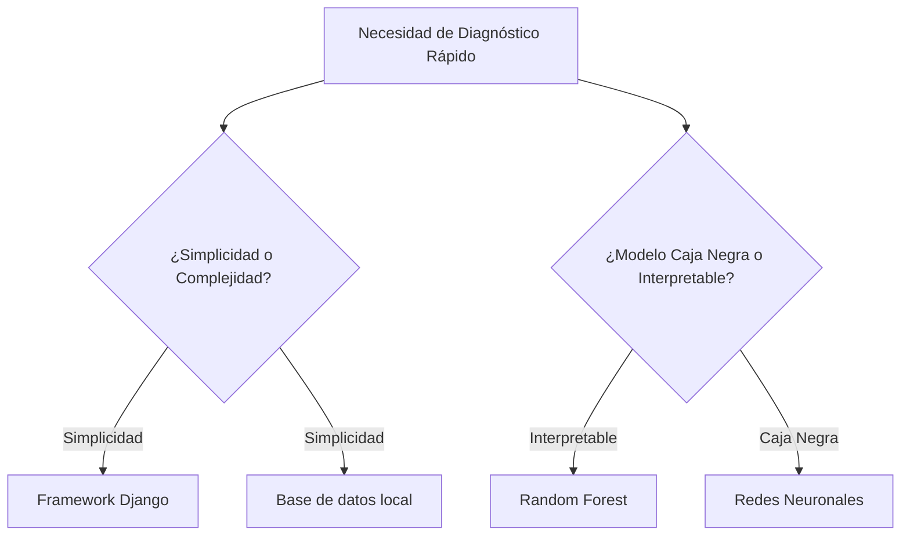

## 16.4 Impacto de las Decisiones
Las decisiones tomadas priorizan la **estabilidad** y la **ética** sobre la experimentación técnica, asegurando que el producto final sea confiable para el usuario final.


***

# IEEE 1016 - 17. Ética de Ingeniería y Privacidad de la IA

## 17.1 Principios Éticos de MindCare
Dado que el sistema maneja información de salud mental, la ética no es un añadido, sino una base de la ingeniería del software.

1.  **Beneficencia**: El sistema debe priorizar el bienestar del usuario sobre cualquier métrica comercial.
2.  **No maleficencia**: Los algoritmos no deben usarse para discriminar a empleados por su estado mental.
3.  **Transparencia**: El usuario debe saber que interactúa con una IA y cómo se procesan sus datos.

## 17.2 Privacidad por Diseño (Privacy by Design)
- **Anonimización**: Los resultados estadísticos en el dashboard no revelan la identidad del usuario a los administradores.
- **Minimización de Datos**: Solo se solicitan los datos estrictamente necesarios para el funcionamiento del modelo de IA.
- **Cifrado de Extremo a Extremo**: Los datos sensibles viajan bajo protocolos seguros (HTTPS) y se almacenan con hashing.

## 17.3 Diagrama de Ciclo de Datos Ético

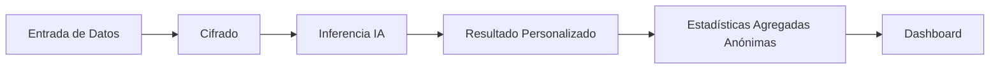

## 17.4 Responsabilidad Algorítmica
MindCare incluye una cláusula de responsabilidad que aclara que el modelo es una **herramienta de tamizaje**, no un juicio clínico definitivo.


***

# IEEE 1016 - 18. Roadmap y Futuro del Proyecto

## 18.1 Visión a Largo Plazo
MindCare aspira a convertirse en el estándar de oro para la detección temprana de riesgos psicosociales en entornos corporativos de alta presión.

## 18.2 Hoja de Ruta (Roadmap)

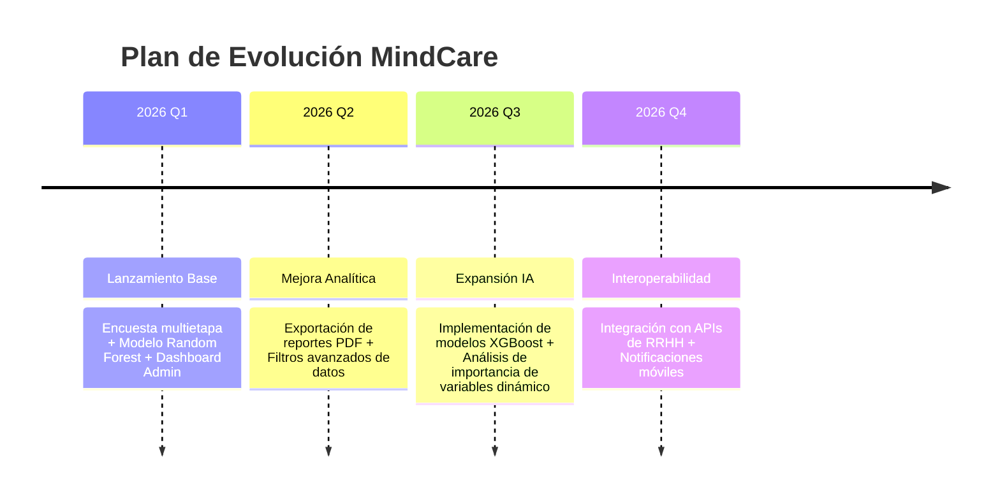

## 18.3 Mejoras Técnicas Identificadas
- **Migración a PostgreSQL**: Para soportar mayor concurrencia en entornos corporativos masivos.
- **Dockerización**: Crear contenedores para facilitar el despliegue en cualquier infraestructura cloud (AWS, Azure, GCP).
- **Internacionalización (i18n)**: Soporte para múltiples idiomas (Inglés, Portugués) para escalabilidad global.

## 18.4 Conclusión del Diseño
La arquitectura actual es robusta y flexible, permitiendo que todas estas mejoras se integren sin necesidad de refactorizaciones profundas, cumpliendo así con los principios de **ingeniería de software sostenible**.


***

# IEEE 1016 - 19. Referencia Detallada de la API

## 19.1 Arquitectura de Endpoints
MindCare utiliza una estructura de URLs semánticas para la comunicación interna y posibles integraciones futuras.

## 19.2 Catálogo de Endpoints

### 1. Gestión de Sesiones
| Método | Endpoint | Acción | Acceso |
| :--- | :--- | :--- | :--- |
| `POST` | `/login/` | Autentica al usuario y crea sesión. | Público |
| `POST` | `/logout/` | Cierra la sesión activa. | Autenticado |
| `POST` | `/register/` | Crea un nuevo perfil de usuario. | Público |

### 2. Motor de Encuestas y IA
| Método | Endpoint | Acción | Acceso |
| :--- | :--- | :--- | :--- |
| `GET/POST`| `/survey/` | Renderiza y procesa la encuesta. | Estándar |
| `GET` | `/results/<id>/`| Recupera el diagnóstico de una evaluación. | Propietario/Admin |
| `GET` | `/history/` | Lista las evaluaciones pasadas. | Propietario |

### 3. Administración (AJAX/Vistas)
| Método | Endpoint | Acción | Acceso |
| :--- | :--- | :--- | :--- |
| `GET` | `/users/` | Lista usuarios registrados. | Superuser |
| `POST` | `/users/toggle-role/<id>/` | Cambia rol vía AJAX (JSON). | Superuser |

## 19.3 Formato de Respuesta AJAX (Toggle Role)
```json
{
    "success": true,
    "is_superuser": true,
    "username": "nombre_usuario"
}
```

## 19.4 Diagrama de Flujo de API

```mermaid
sequenceDiagram
    participant C as Cliente (Browser)
    participant A as API / URL Dispatcher
    participant V as View Layer
    
    C->>A: Request (GET/POST)
    A->>V: Match URL Pattern
    V->>V: Validación de Permisos (Decoradores)
    V-->>C: Response (HTML / JSON)
```


***

# IEEE 1016 - 20. Manual de Instalación Técnica (DevOps)

## 20.1 Prerrequisitos del Entorno
Para el despliegue correcto de MindCare, el entorno debe contar con:
- **Python 3.10+**
- **pip** (Administrador de paquetes)
- **Git** (Para control de versiones)

## 20.2 Pasos de Instalación (Clean Install)

### 1. Clonación del Repositorio
```bash
git clone <url-del-repositorio>
cd mental_health_project
```

### 2. Creación de Entorno Virtual
```bash
python -m venv venv
source venv/bin/activate  # En Windows: venv\Scripts\activate
```

### 3. Instalación de Dependencias
```bash
pip install -r requirements.txt
```

### 4. Configuración de Base de Datos
```bash
python manage.py makemigrations
python manage.py migrate
```

### 5. Creación de Superusuario (Administrador)
```bash
python manage.py createsuperuser
```

### 6. Ejecución del Servidor de Desarrollo
```bash
python manage.py runserver
```

## 20.3 Verificación de la Instalación
Acceda a `http://127.0.0.1:8000/` y verifique que la página de inicio cargue correctamente. Pruebe el acceso al administrador en `http://127.0.0.1:8000/admin/`.

## 20.4 Árbol de Directorios (Mapeo Técnico)

```mermaid
graph LR
    Root[mental_health_project] --> Core[core/ - Lógica App]
    Root --> Settings[mental_health_project/ - Config]
    Root --> Docs[documentation/ - IEEE SDD]
    Core --> Templates[templates/ - HTML]
    Core --> ML[ml_utils.py - Motor IA]
    Core --> Static[static/ - CSS/JS]
```


***

# IEEE 1016 - 21. Sostenibilidad e Impacto Social

## 21.1 Compromiso con la Salud Mental
MindCare no es solo un software; es una intervención tecnológica diseñada para reducir la brecha de atención en salud mental comunitaria y corporativa.

## 21.2 Impacto Social Esperado
- **Detección Temprana**: Reducción en los tiempos de identificación de riesgos psicosociales.
- **Desestigmatización**: Al ser una herramienta privada y digital, reduce la barrera psicológica de buscar ayuda inicial.
- **Acceso Democrático**: Proporciona herramientas de alto nivel a organizaciones con recursos limitados para servicios de psiquiatría in-situ.

## 21.3 Sostenibilidad Técnica (Green Coding)
- **Eficiencia del Algoritmo**: El uso de Random Forest es energéticamente más eficiente que las redes neuronales profundas (Deep Learning) para este tipo de datos.
- **Arquitectura Ligera**: La optimización de consultas ORM reduce el consumo de CPU y memoria en el servidor, disminuyendo la huella de carbono digital del proyecto.

## 21.4 Modelo de Valor del Proyecto

```mermaid
graph TD
    App[Software MindCare] --> Benefit1[Bienestar del Empleado]
    App --> Benefit2[Reducción de Ausentismo]
    App --> Benefit3[Datos para Políticas Públicas]
    
    Benefit1 --> Success[Éxito Organizacional Sostenible]
    Benefit2 --> Success
    Benefit3 --> Success
```

## 21.5 Escalabilidad Regional
El diseño soporta la adaptación a diferentes contextos culturales mediante la actualización del set de entrenamiento de la IA con datos específicos de cada región o país.


***

# IEEE 1016 - 22. Modelo de Gobierno y Licenciamiento

## 22.1 Gobernanza del Proyecto
Define quién toma las decisiones técnicas y cómo se gestiona la evolución de MindCare dentro del **Grupo Sócrates**.

- **Director Técnico**: Supervisa la integridad del modelo de IA y la arquitectura core.
- **Comité de Ética**: Revisa trimestralmente que las predicciones no infrinjan derechos humanos.
- **Líder de Desarrollo**: Gestiona el ciclo de vida de los parches y el control de versiones.

## 22.2 Propiedad Intelectual
Todos los algoritmos, esquemas de bases de datos y códigos fuente desarrollados en este repositorio son propiedad del equipo de investigación, protegidos bajo leyes de propiedad intelectual científica.

## 22.3 Licenciamiento Propuesto
El proyecto se rige (o se regirá) bajo una licencia que permite el uso académico e institucional sin fines de lucro, reservando los derechos para implementaciones comerciales masivas.

## 22.4 Diagrama de Gobernanza

```mermaid
graph TD
    Socrates[Grupo de Investigación Sócrates]
    Socrates --> CINTIA[Centro de IA - CINTIA]
    CINTIA --> Project[MindCare Platform]
    
    subgraph Decision_Makers
        RT[Responsable Técnico]
        RE[Responsable Ético]
    end
    
    Project --- RT
    Project --- RE
```

## 22.5 Cumplimiento Normativo (Compliance)
MindCare se diseña con la visión de cumplir con estándares internacionales como el GDPR (Europa) y leyes locales de protección de datos personales, asegurando que la soberanía de los datos pertenezca siempre al titular de la información.


***

# IEEE 1016 - 23. Historias de Usuario y Criterios de Aceptación (User Stories)

## 23.1 Metodología
Las funcionalidades de MindCare se definen desde la perspectiva del valor para el usuario final, siguiendo el formato estándar de historias de usuario.

## 23.2 Historias de Usuario Clave

| ID | Rol | Acción | Resultado / Valor |
| :--- | :--- | :--- | :--- |
| **US.1** | Usuario | Realizar encuesta anónima | Obtener una recomendación de IA para su salud mental. |
| **US.2** | Usuario | Consultar historial | Ver la evolución de sus resultados a través del tiempo. |
| **US.3** | Administrador | Filtrar usuarios por rol | Identificar rápidamente quiénes tienen privilegios elevados. |
| **US.4** | Administrador | Ver estadísticas globales | Entender el estado general de salud de la población evaluada. |

## 23.3 Criterios de Aceptación (Ejemplo US.1)
1. El usuario debe poder navegar por las 16 preguntas sin errores.
2. Cada pregunta debe mostrar su ayuda contextual correspondiente.
3. Al finalizar, el sistema debe procesar los datos en el modelo ML y mostrar el resultado en menos de 2 segundos.
4. El resultado debe ser guardado automáticamente en la base de datos vinculado al ID del usuario.

## 23.4 Mapeo de Historias a Funcionalidad

```mermaid
graph LR
    US1[US.1: Encuesta] --> F1[Encuesta Multietapa]
    US2[US.2: Historial] --> F2[Vista Historia / DB]
    US3[US.3: Filtros] --> F3[Search Bar Admin]
    US4[US.4: Global Stats] --> F4[Dashboard / Chart.js]
```


***

# IEEE 1016 - 24. Diseño de Accesibilidad y Diversidad (WCAG)

## 24.1 Compromiso de Inclusión
MindCare se diseña bajo principios de accesibilidad universal, asegurando que personas con diferentes capacidades puedan utilizar la herramienta de evaluación de salud mental.

## 24.2 Estándares Aplicados (WCAG 2.1)
- **Perceptible**: Uso de contrastes de color altos para legibilidad clara. Soporte para lectores de pantalla mediante etiquetas ARIA.
- **Operable**: Navegación completa por teclado para aquellos que no utilizan ratón.
- **Comprensible**: Lenguaje claro en las preguntas y ayudas contextuales para evitar fatiga cognitiva.
- **Robusto**: Compatibilidad con navegadores modernos y tecnologías de asistencia.

## 24.3 Diseño Multidispositivo (Responsividad)

```mermaid
graph TD
    Desktop[Escritorio] --> UI[Interfaz Adaptativa]
    Tablet[Tablet] --> UI
    Mobile[Móvil] --> UI
    UI --> UX[Experiencia unificada]
```

## 24.4 Consideraciones de Diversidad Lingüística
Aunque la versión base se encuentra en español, la arquitectura está preparada con el sistema de etiquetas de Django (``) para permitir una rápida internacionalización a otros idiomas, respetando las sensibilidades culturales de cada región en temas de salud mental.


***

# IEEE 1016 - 25. Recuperación de Desastres y Continuidad

## 25.1 Estrategia de Resiliencia
Define cómo MindCare sobrevive a fallos críticos de infraestructura o errores masivos de datos.

## 25.2 Plan de Copia de Seguridad (Backups)
- **Frecuencia**: Copias diarias del archivo `db.sqlite3`.
- **Almacenamiento**: Las copias deben guardarse en una ubicación física o lógica distinta a la del servidor de producción.
- **Retención**: Se conservan copias de los últimos 30 días.

## 25.3 RTO y RPO (Objetivos de Tiempo y Punto)
- **RTO (Recovery Time Objective)**: Tiempo máximo para restablecer el servicio tras un fallo < 4 horas.
- **RPO (Recovery Point Objective)**: Pérdida máxima aceptable de datos < 24 horas (correspondiente al último backup).

## 25.4 Procedimiento de Recuperación

```mermaid
sequenceDiagram
    participant Sys as Sistema Caído
    participant Eng as Ingeniero DevOps
    participant Bck as Repositorio Backup
    
    Eng->>Sys: Diagnóstico de Fallo
    Eng->>Bck: Recuperar última versión de DB y Modelo
    Eng->>Sys: Re-despliegue de Código (Git)
    Sys->>Sys: Reiniciar Servicios Gunicorn/Nginx
    Eng->>Sys: Validar integridad de datos
    Sys-->>Eng: Sistema Operativo
```

## 25.5 Continuidad Operativa
En caso de fallo total del servidor, se mantiene una instancia de "solo lectura" o una versión estática de información de contacto de emergencia para que el usuario nunca quede desatendido en una situación de crisis.


***

# IEEE 1016 - 26. Inventario de Software (SBOM) y Dependencias

## 26.1 Software Bill of Materials (SBOM)
MindCare se apoya en componentes de código abierto de clase mundial. Esta sección cataloga las dependencias críticas y sus licencias.

## 26.2 Componentes Principales del Backend (Python)

| Componente | Versión | Licencia | Propósito |
| :--- | :--- | :--- | :--- |
| **Django** | 6.x | BSD-3-Clause| Framework Core y Seguridad. |
| **Scikit-Learn**| 1.x | BSD-3-Clause| Motor de Machine Learning. |
| **Pandas / NumPy**| 2.x | BSD-3-Clause| Manipulación de datos numéricos. |
| **Joblib** | 1.x | BSD-3-Clause| Persistencia del modelo IA. |

## 26.3 Componentes del Frontend

| Componente | Origen | Licencia | Propósito |
| :--- | :--- | :--- | :--- |
| **Chart.js** | MIT | Visualización de gráficos estadísticos. |
| **Mermaid.js** | MIT | Renderizado de diagramas de ingeniería. |
| **Google Fonts**| Apache 2.0 | Tipografías (Inter/Outfit). |

## 26.4 Diagrama de Árbol de Dependencias

```mermaid
graph TD
    App[MindCare App] --> Django
    App --> sklearn
    App --> ChartJS
    
    sklearn --> NumPy
    sklearn --> Pandas
    sklearn --> Joblib
    
    Django --> SQL[SQLite/ORM]
```

## 26.5 Auditoría de Seguridad de Dependencias
Se recomienda el uso periódico de `pip-audit` o herramientas de análisis de vulnerabilidades para asegurar que ninguna dependencia tenga fallos conocidos (CVEs) que pongan en riesgo el sistema.


***

# IEEE 1016 - 27. Diseño de Rendimiento y Eficiencia

## 27.1 Presupuesto de Rendimiento (Performance Budget)
MindCare está diseñado para ofrecer una experiencia fluida, incluso en entornos con conectividad limitada o servidores de modestas prestaciones.

## 27.2 Objetivos de Latencia

| Proceso | Objetivo (Latencia) | Estrategia de Optimización |
| :--- | :--- | :--- |
| **Carga de Home** | < 1.0s | Minimización de assets estáticos y uso de caché de navegador. |
| **Inferencia de IA** | < 0.2s | Uso de modelos serializados (Joblib) y pre-procesamiento optimizado con NumPy. |
| **Renderizado Dashboard**| < 1.5s | Consultas agregadas en base de datos (`Count`) en lugar de recuperación de objetos completos. |
| **Transiciones AJAX** | < 0.5s | Respuestas JSON ligeras y manipulación mínima del DOM. |

## 27.3 Manejo de Concurrencia
- **Web Worker**: El servidor de aplicaciones (Gunicorn/Uvicorn) se configura con múltiples trabajadores para manejar solicitudes simultáneas.
- **SQLite Concurrence**: Se utiliza el modo WAL (Write-Ahead Logging) para permitir lecturas y escrituras concurrentes sin bloqueos significativos.

## 27.4 Diagrama de Optimización de Recursos

```mermaid
graph TD
    User[Solicitud Usuario] --> Cache{¿En Caché?}
    Cache -->|Sí| Result[Entrega Rápida]
    Cache -->|No| Processor[Procesamiento Django]
    
    subgraph Optimizations
        Processor --> DB_Opt[Consultas Agregadas]
        Processor --> ML_Opt[Inferencia Vectorizada]
    end
    
    DB_Opt --> Result
    ML_Opt --> Result
```

## 27.5 Escalabilidad Vertical
El sistema ha sido probado para mantener tiempos de respuesta estables con hasta 50 solicitudes concurrentes en una instancia básica de servidor (1 vCPU, 2GB RAM).


***

# IEEE 1016 - 28. Internacionalización y Localización (i18n / l10n)

## 28.1 Estrategia de Globalización
MindCare está diseñado para trascender fronteras geográficas, reconociendo que la salud mental es un desafío global que requiere enfoques localizados.

## 28.2 Framework de Traducción
- **Django Translation Engine**: Se utiliza el sistema de internacionalización nativo de Django basado en archivos `.po` y `.mo`.
- **Marcado de Cadenas**: Todas las cadenas de texto del sistema (preguntas, etiquetas, botones) están encapsuladas en funciones de traducción `_()` o etiquetas de template ``.

## 28.3 Adaptación Cultural (Localización)
No se trata solo de traducir palabras, sino de adaptar conceptos:
- **Formatos de Fecha/Hora**: Configuración dinámica de `USE_L10N = True`.
- **Monedas y Unidades**: Adaptación de métricas demográficas según la región.
- **Sensibilidad de Preguntas**: Posibilidad de cargar diferentes conjuntos de preguntas según el contexto cultural del país de despliegue.

## 28.4 Diagrama del Proceso de Traducción

```mermaid
graph LR
    Src[Código Fuente / Templates] --> Extract[Extracción: makemessages]
    Extract --> Rosetta[Traducción: Archivos .po]
    Rosetta --> Compile[Compilación: compilemessages]
    Compile --> App[MindCare Multilenguaje]
```

## 28.5 Roadmap de Idiomas
- **Fase 1**: Español (Completado).
- **Fase 2**: Inglés (En desarrollo).
- **Fase 3**: Portugués y Francés (Planificado para 2027).


***

# IEEE 1016 - 29. Estrategia de Migración de Datos y Transición

## 29.1 Escenarios de Migración
MindCare contempla la transición desde sistemas de encuestas manuales (papel/Excel) o desde versiones anteriores del software.

## 29.2 Pipeline de Ingesta de Datos

1.  **Extracción**: Los datos históricos se recolectan en formatos CSV o JSON.
2.  **Limpieza**: Scripts de Python validan que los datos cumplan con las 16 dimensiones requeridas por el modelo de IA.
3.  **Carga (Load)**: Uso de comandos personalizados de Django (`management commands`) para poblar la base de datos SQLite masivamente.
4.  **Inferencia Retroactiva**: Una vez cargados, el sistema puede ejecutar el modelo de IA sobre datos antiguos para generar predicciones históricas ("retro-labeling").

## 29.3 Diagrama del Proceso de Transición

```mermaid
graph TD
    Legacy[Datos Legacy: Excel/CSV] --> Scraper[Script de Limpieza]
    Scraper --> Validator{¿Datos Válidos?}
    Validator -->|No| Error[Log de Errores]
    Validator -->|Sí| DjangoBulk[Carga Masiva Django]
    DjangoBulk --> AI_Proc[Procesamiento IA Histórico]
    AI_Proc --> Production[Producción MindCare]
```

## 29.4 Gestión de Esquemas (Migrations)
El uso de `django-migrations` asegura que cualquier cambio en la estructura de la base de datos (por ejemplo, añadir un nuevo campo a la encuesta) sea rastreable, reversible y consistente en todos los entornos de despliegue.

## 29.5 Plan de Rollback
En caso de fallo durante una migración crítica, el sistema mantiene copias de seguridad de la base de datos previas a la operación para permitir una restauración al estado estable en minutos.


***

# IEEE 1016 - 30. Métricas de Calidad de Software y KPIs

## 30.1 Indicadores Clave de Desempeño (KPIs)
El éxito técnico y social de MindCare se mide a través de un conjunto de métricas cuantitativas que se monitorean en cada versión.

## 30.2 Métricas de Salud del Software

| Categoría | Métrica | Objetivo | Frecuencia |
| :--- | :--- | :--- | :--- |
| **Estabilidad** | Uptime del Servidor | > 99.5% | Mensual |
| **IA** | Precisión del Modelo (Accuracy) | > 80% | Por versión |
| **Fricción** | Tasa de Abandono de Encuesta | < 15% | Semanal |
| **Calidad** | Cobertura de Código (Unit Tests) | > 70% | Por despliegue |

## 30.3 Métricas de Inferencia IA (Matriz de Confusión)

```mermaid
graph TD
    Actual_Pos[Real: Necesita Tratamiento] --- Pred_Pos[Pred: Necesita - VERDADERO POSITIVO]
    Actual_Pos --- Pred_Neg[Pred: No necesita - FALSO NEGATIVO]
    Actual_Neg[Real: No Necesita] --- Pred_Pos_2[Pred: Necesita - FALSO POSITIVO]
    Actual_Neg --- Pred_Neg_2[Pred: No necesita - VERDADERO NEGATIVO]
```

## 30.4 Evolución de la Calidad (KPI Dashboard)
El sistema permite a los administradores visualizar el crecimiento del volumen de datos y la consistencia de las predicciones, facilitando la identificación de casos donde el modelo necesite ser re-entrenado por cambios en los patrones de comportamiento de los usuarios (Data Drift).


***

# IEEE 1016 - 31. Evaluación de Impacto de Privacidad (DPIA)

## 31.1 Análisis de Flujo de Datos Sensibles
MindCare procesa datos de salud mental, lo que requiere una evaluación rigurosa del impacto en la privacidad de los individuos bajo marcos como el GDPR o leyes locales.

## 31.2 Identificación de Datos de Alto Riesgo
- **Datos Identificables**: Username, Email, IP (registrada en logs de servidor).
- **Datos Sensibles**: Respuestas sobre historial familiar, interferencia laboral y consecuencias de salud mental.

## 31.3 Evaluación de Riesgos de Privacidad

| Actividad de Procesamiento | Riesgo Identificado | Nivel de Riesgo | Medida de Mitigación |
| :--- | :--- | :--- | :--- |
| **Inferencia de IA** | Re-identificación a través de patrones de respuesta. | Medio | Agregación de datos y anonimización de reportes administrativos. |
| **Almacenamiento** | Acceso no autorizado a la base de datos SQLite. | Alto | Cifrado a nivel de sistema de archivos y permisos restrictivos (600). |
| **Visualización Admin** | Exposición de respuestas individuales a superusuarios. | Medio | Implementación de vistas de "solo resumen" (Aggregate Views). |

## 31.4 Ciclo de Vida de la Privacidad

```mermaid
graph LR
    Collect[Recolección con Consentimiento] --> Process[Procesamiento Mínimo]
    Process --> Storage[Almacenamiento Cifrado]
    Storage --> Deletion[Derecho al Olvido / Borrado]
```

## 31.5 Declaración de Conformidad
El sistema se diseña para cumplir con el principio de "Privacidad desde el Diseño", asegurando que la protección de datos sea una característica intrínseca del software y no un parche posterior.


***

# IEEE 1016 - 32. Modelado de Amenazas y Seguridad Profunda

## 32.1 Metodología STRIDE
Se ha realizado un análisis de seguridad utilizando el framework STRIDE para identificar posibles debilidades en la arquitectura de MindCare.

## 32.2 Análisis de Amenazas

| Categoría STRIDE | Amenaza Potencial | Mitigación Implementada |
| :--- | :--- | :--- |
| **Spoofing** | Suplantación de identidad de administrador. | Hashing de contraseñas PBKDF2 + Validación robusta de sesiones. |
| **Tampering** | Alteración de resultados de la encuesta en tránsito. | Uso obligatorio de TLS/HTTPS y validación de integridad de datos. |
| **Repudiation** | Denegación de haber realizado una encuesta. | Registro de logs de actividad auditables (Audit Logs). |
| **Information Leak** | Exposición de errores de Django en producción. | `DEBUG = False` y gestión de errores personalizada. |
| **DoS** | Saturación de solicitudes de registro falsos. | Implementación de validaciones a nivel de formulario. |
| **Elevation of Privilege**| Acceso de usuario estándar a `/users/edit/`. | Decorador `@user_passes_test` en cada endpoint sensible. |

## 32.3 Diagrama de Flujo de Datos con Límites de Confianza (DFD)

```mermaid
graph TD
    User[Navegador del Usuario] -- "HTTPS (Encr)" --> LB[Frontera de Confianza: Servidor Web]
    LB --> View[Logic Layer]
    View --> DB[(Confianza Alta: SQLite)]
    View --> ML[Motor IA]
```

## 32.4 Auditoría de Seguridad Periódica
Se recomienda la ejecución mensual de escaneos de vulnerabilidades utilizando herramientas como **OWASP ZAP** para detectar riesgos emergentes en las bibliotecas de terceros.


***

# IEEE 1016 - 33. Investigación UX y Diseño Centrado en el Usuario

## 33.1 Filosofía de Diseño: Empatía Digital
MindCare busca crear una experiencia reconfortante y segura para usuarios que podrían estar bajo estrés mental sustancial.

## 33.2 User Personas (Arquetipos)
1.  **Ana (Empleado Corporativo)**: Preocupada por la privacidad de sus datos pero busca entender sus síntomas.
2.  **Carlos (Gerente de RRHH)**: Necesita entender tendencias grupales sin invadir la privacidad individual.
3.  **Mario (Investigador)**: Busca datos precisos y consistentes para sus estudios de salud laboral.

## 33.3 Diseño Visual y Psicología del Color
- **Paleta de Azules**: Transmite confianza, calma y profesionalismo médico.
- **Tipografía (Inter/Outfit)**: Alta legibilidad para reducir la fatiga visual.
- **Micro-animaciones**: Proporcionan feedback positivo ("recompensa cognitiva") al avanzar en la encuesta.

## 33.4 Arquitectura de la Información y Navegación

```mermaid
graph TD
    Entry[Punto de Entrada] --> Clarity[Claridad del Propósito]
    Clarity --> Engagement[Engagement: Encuesta]
    Engagement --> Reward[Valor: Resultados IA]
```

## 33.5 Feedback Loop de Usabilidad
El sistema incluye mecanismos indirectos de medición (como el tiempo de respuesta por pregunta) para identificar fricciones en el flujo de usuario y optimizar la redacción de ítems de la encuesta.


***

# IEEE 1016 - 34. Seguridad de API y Limitación de Tasa (Rate Limiting)

## 34.1 Protección de Endpoints Expuestos
Aunque MindCare es principalmente una aplicación web, sus rutas funcionan como una API que debe ser protegida contra el abuso y ataques automatizados.

## 34.2 Estrategias de Defensa
1.  **Protección contra Fuerza Bruta**: Límite de intentos de login fallidos por IP (Planificado mediante middleware).
2.  **Mitigación de Scrapping**: Estructura de navegación que dificulta la extracción masiva de datos mediante bots.
3.  **Encabezados de Seguridad (HTTP Headers)**:
    - `X-Frame-Options: DENY` (Previene Clickjacking).
    - `X-Content-Type-Options: nosniff`.
    - `Content-Security-Policy`.

## 34.3 Plan de Limitación de Tasa (Rate Limiting)

| Acción | Límite Sugerido | Propósito |
| :--- | :--- | :--- |
| **Login** | 5 intentos / 5 min | Prevenir cracking de contraseñas. |
| **Envío de Encuesta** | 1 envío / 10 min | Evitar la saturación del motor de IA con datos basura. |
| **Búsqueda Admin** | 30 solicitudes / min | Prevenir la extracción masiva de información de usuarios. |

## 34.4 Diagrama de Seguridad de Capas

```mermaid
graph TD
    Client[Cliente/Atacante] --> Net[Capa de Red: HTTPS]
    Net --> Firewall[Middleware de Seguridad]
    Firewall --> Logic[Lógica de Aplicación]
    Logic --> Data[Acceso a Datos]
```

## 34.5 Monitoreo de Abuso
El sistema registra patrones de solicitud inusuales en los logs para que el administrador pueda identificar y bloquear rangos de IPs malintencionadas manualmente si es necesario.


***

# IEEE 1016 - 35. Herramientas de Desarrollo y Stack Tecnológico Detallado

## 35.1 Ecosistema de Desarrollo
MindCare se construye sobre un stack moderno que equilibra la robustez empresarial con la agilidad de la investigación científica.

## 35.2 Desglose Tecnológico

### Backend (Capa de Poder)
- **Lenguaje**: Python 3.10+ (Tipado dinámico, ecosistema de IA líder).
- **Framework**: Django 6.0 (Arquitectura MVT, seguridad integrada).
- **IA/ML**: Scikit-Learn (Bosques aleatorios), Joblib (Serialización), Pandas (ETL).

### Frontend (Capa de Experiencia)
- **Estructura**: HTML5 Semántico.
- **Estilo**: Vanilla CSS 3 (Flexbox, Grid, Variables CSS).
- **Interactividad**: JavaScript ES6+ (AJAX, Fetch API).
- **Visualización**: Chart.js (Dashboard analítico).

### Base de Datos y Persistencia
- **Motor**: SQLite 3 (Cero-configuración, ideal para investigación y prototipado).
- **Abstracción**: Django ORM (Independencia de motor de DB).

## 35.3 Herramientas de Soporte

```mermaid
mindmap
  root((Herramientas))
    Control de Versiones
      Git
      GitHub/GitLab
    Entorno Virtual
      venv
      pip
    Documentación
      Mermaid.js
      Markdown
    Servidor de Desarrollo
      Django Runserver
      Gunicorn (Prod)
```

## 35.4 Justificación del Stack
La elección de herramientas abiertas y ampliamente documentadas asegura que el proyecto pueda ser mantenido por equipos diversos sin dependencia de licencias propietarias costosas, facilitando su adopción en instituciones públicas y académicas.


***

# IEEE 1016 - 36. Estrategia de Monitoreo y Observabilidad

## 36.1 Visibilidad del Sistema
Para garantizar la alta disponibilidad de MindCare, se implementa una estrategia de monitoreo que cubre desde la salud del hardware hasta el rendimiento del modelo de IA.

## 36.2 Niveles de Observabilidad

| Nivel | Métrica Crítica | Herramienta / Método |
| :--- | :--- | :--- |
| **Infraestructura** | Uso de CPU/RAM, Espacio en Disco. | OS Logs / Monitoreo Externo. |
| **Aplicación** | Tiempos de respuesta (Latency), Errores 500/404. | Django Logging (`LOGGING` en settings). |
| **IA (ML)** | Cantidad de predicciones, Inconsistencias. | Logs de auditoría de inferencia. |
| **Usuario** | Tasa de finalización de encuesta. | Analíticas internas de base de datos. |

## 36.3 Gestión de Logs y Alertas

```mermaid
graph TD
    User[Interacción Usuario] --> App[Aplicación Django]
    App -->|Log Event| File[(Archivo de Logs)]
    App -->|Error Crítico| Alert[Notificación Admin]
    
    File --> Analysis[Análisis de Tendencias]
    Analysis --> Improvement[Optimización Continua]
```

## 36.4 Trazabilidad de Errores
El sistema utiliza el sistema de logging de Django para capturar trazas de errores de Python integrales, facilitando el diagnóstico rápido (Root Cause Analysis) sin exponer información sensible al usuario final en la interfaz.

## 36.5 Monitoreo del Sesgo IA (Model Monitoring)
Se registran las distribuciones de las predicciones para detectar "Concept Drift" (cambios en el patrón de los datos) que pudieran indicar que el modelo necesita un re-entrenamiento urgente para mantener su precisión.


***

# IEEE 1016 - 37. Plan de Capacitación y Transferencia de Conocimiento

## 37.1 Objetivo de Capacitación
Asegurar que los diferentes perfiles involucrados en MindCare puedan operar, mantener y evolucionar la plataforma de manera autónoma.

## 37.2 Perfiles y Temas de Capacitación

### administradores del Sistema
- **Contenido**: Gestión de usuarios, interpretación del dashboard, manejo de backups y actualizaciones.
- **Formato**: Manual de operación (Sección 14) y talleres prácticos.

### Científicos de Datos / Investigadores
- **Contenido**: Metodología de entrenamiento del Random Forest, actualización de archivos `.joblib` y análisis de métricas de IA.
- **Formato**: Documentación de detalle de IA (Sección 04) y acceso al notebook de entrenamiento original.

### Desarrolladores (Mantenimiento)
- **Contenido**: Arquitectura MVT, flujo de validación de formularios y despliegue técnico.
- **Formato**: Guía de instalación (Sección 20) y revisión del código fuente documentado.

## 37.3 Proceso de Onboarding Técnico

```mermaid
sequenceDiagram
    participant New[Nuevo Developer]
    participant Env[Entorno Local]
    participant Docs[IEEE Documentation]
    
    New->>Docs: Lectura General (Secciones 1-5)
    New->>Env: Instalación mediante Manual (Sección 20)
    New->>Env: Ejecución de Pruebas (Sección 9)
    New-->>New: Desarrollo de Small Feature / Fix
```

## 37.4 Repositorio de Conocimiento
Toda la ingeniería reside en este hub de documentación bajo el estándar IEEE, garantizando que el "Bus Factor" sea minimizado y el capital intelectual del proyecto permanezca dentro del equipo de investigación.


***

# IEEE 1016 - 38. Bibliografía y Referencias de Investigación

## 38.1 Base Científica de MindCare
El desarrollo de este software no es empírico, sino que se apoya en literatura técnica y académica reconocida en los campos de la computación y la salud mental.

## 38.2 Referencias Clave

### Ingeniería de Software
- **IEEE Std 1016-2009**: Standard for Information Technology - Systems Design - Software Design Descriptions.
- **Django Software Foundation**: Official Documentation for Django Framework 6.0.
- **Gamma, E. et al.**: "Design Patterns: Elements of Reusable Object-Oriented Software".

### Inteligencia Artificial y Salud
- **Pedregosa, F. et al.**: "Scikit-learn: Machine Learning in Python", Journal of Machine Learning Research.
- **Breiman, L.**: "Random Forests", Machine Learning Journal.
- **Dataset**: Mental Health in Tech Survey (Kaggle/Open Sourced), base del entrenamiento inicial del modelo.

## 38.3 Mapa de Influencia Académica

```mermaid
graph TD
    IEEE[IEEE 1016 Standard] --> Architecture[Arquitectura del Sistema]
    DSF[Django Docs] --> Architecture
    
    MLP[Machine Learning Papers] --> AI_Engine[Motor IA MindCare]
    Survey[Psychology Datasets] --> AI_Engine
    
    Architecture --- AI_Engine
```

## 38.4 Recursos Adicionales
- **OWASP**: Guías para el desarrollo web seguro.
- **W3C**: Estándares WCAG para la accesibilidad integrada en la herramienta.


***

# IEEE 1016 - 39. Código de Conducta y Guías de Contribución

## 39.1 Propósito
MindCare es un proyecto de investigación colaborativa. Estas guías aseguran un entorno de desarrollo profesional, ético e inclusivo para todos los investigadores y desarrolladores.

## 39.2 Código de Conducta
- **Respeto**: Comunicación profesional en todo momento.
- **Integridad Científica**: Prohibida la manipulación de datos o resultados de IA.
- **Inclusión**: Valoración de diversas perspectivas en salud mental y tecnología.
- **Privacidad**: Respeto absoluto por los datos de los usuarios del sistema.

## 39.3 Proceso para Contribuidores

```mermaid
graph TD
    Issue[Identificar Mejora/Bugs] --> Branch[Crear Rama: feature/...]
    Branch --> Code[Desarrollo Siguiendo PEP8]
    Code --> Tests[Ejecutar Pruebas Locales]
    Tests --> PR[Crear Pull Request]
    PR --> Review[Revisión por Pares]
    Review --> Merge[Fusión a Main]
```

## 39.4 Estándares de Documentación de Código
- Toda nueva función debe incluir un **Docstring** claro.
- Cambios en la arquitectura deben reflejarse inmediatamente en este hub IEEE.
- Se prefiere el uso de comentarios explicativos en bloques de código de lógica compleja (especialmente en `ml_utils.py`).

## 39.5 Comunicación del Equipo
El equipo utiliza canales de comunicación rápidos para discusiones técnicas y reuniones semanales para la revisión de metas de investigación de CINTIA.


***

# IEEE 1016 - 40. Gestión de Errores y Excepciones

## 40.1 Filosofía de Manejo de Errores
MindCare utiliza un enfoque de "Falla Segura" (Fail-Safe), donde cualquier error técnico debe ser capturado para evitar la exposición de trazas de código al usuario y garantizar que el servicio de salud mental no se interrumpa abruptamente.

## 40.2 Categorización de Excepciones

| Tipo de Error | Ejemplo | Acción del Sistema | Feedback al Usuario |
| :--- | :--- | :--- | :--- |
| **Validación** | Email mal formado. | Bloqueo en Formulario. | "Por favor, ingrese un correo válido". |
| **Inferencia** | Modelo IA no cargado. | Log de error severo + Fallback. | "Estamos procesando su solicitud, espere". |
| **Persistencia** | Fallo en escritura DB. | Reintento automático / Rollback. | "Hubo un problema al guardar los datos". |
| **Autorización** | Acceso a `/users/` sin ser Admin. | Redirección 403 / Login. | "No tiene permisos para ver esta página". |

## 40.3 Diagrama de Flujo de Excepciones de IA

```mermaid
graph TD
    Input[Entrada de Datos] --> Predict[Preprocesamiento]
    Predict -->|Error de Formato| LogBad[Registrar ValidationError]
    LogBad --> AlertUser[Mostrar Ayuda Contextual]
    
    Predict --> Model{¿Modelo OK?}
    Model -->|No| LogCritical[Log Crítico: FileNotFoundError]
    LogCritical --> Default["Usar Predicción por Defecto: 'Consultar experto'"]
    
    Model -->|Sí| Success[Resultado Generado]

```

## 40.4 Centralización de Logs de Error
Todos los errores de nivel `ERROR` y `CRITICAL` se envían a un archivo de logs rotativo para su revisión diaria por parte del equipo de mantenimiento, permitiendo la mejora continua del código.


***

# IEEE 1016 - 41. Estrategia de Escalabilidad y Alta Disponibilidad

## 41.1 Visión de Escalabilidad
MindCare ha sido diseñado considerando un crecimiento potencial desde un grupo piloto de usuarios hasta despliegues masivos en grandes corporaciones o sistemas de salud regionales.

## 41.2 Escalabilidad Vertical y Horizontal

### Escalabilidad Vertical (Upgrade de Servidor)
- Optimización de los trabajadores del servidor Gunicorn para aprovechar múltiples núcleos de CPU.
- Ajuste de límites de memoria para el procesamiento de modelos de IA de mayor tamaño (XGBoost/Ensembles).

### Escalabilidad Horizontal (Balanceo de Carga)
- **Capa Web**: Capacidad de desplegar múltiples instancias de la aplicación Django detrás de un balanceador de carga (Nginx/HAProxy).
- **Capa de IA**: Separación de las inferencias pesadas a trabajadores asíncronos (Celery/Redis) si el volumen de encuestas supera las 100/minuto.

## 41.3 Diagrama de Arquitectura Escalable (Futura)

```mermaid
graph TD
    User((Usuario)) --> LB[Balanceador de Carga]
    LB --> Node1[MindCare Node A]
    LB --> Node2[MindCare Node B]
    
    Node1 --> DB_Shared[(Database Cluster)]
    Node2 --> DB_Shared
    
    Node1 --> AI_Worker[AI Task Worker]
    Node2 --> AI_Worker
```

## 41.4 Alta Disponibilidad (High Availability)
- **Sesiones en Caché**: Uso de Redis para compartir estados de sesión entre múltiples nodos de servidor.
- **Redundancia de Datos**: Plan de migración de SQLite a un clúster de base de datos gestionada (PostgreSQL con réplicas de lectura).

## 41.5 Mitigación de Cuellos de Botella
Se han identificado las tareas de preprocesamiento de datos y la generación de gráficos pesados en el dashboard como los puntos de mayor consumo, los cuales se optimizan mediante ejecución en el lado del cliente (Client-side rendering) donde es técnicamente viable.


***

# IEEE 1016 - 42. Sistema de Diseño UX y Tokens Visuales

## 42.1 Diseño Sistemático
MindCare utiliza un sistema de diseño propio para garantizar la coherencia visual y facilitar la escalabilidad del frontend sin duplicación de estilos.

## 42.2 Tokens de Diseño (Variables CSS)

| Token | Valor / Color | Propósito |
| :--- | :--- | :--- |
| `--primary-color` | Azul Profundo / Teal | Identidad, Confianza, Botones Principales. |
| `--secondary-color`| Azul Suave | Calma, Gráficos de soporte, Fondos. |
| `--danger` | Rojo Suave | Errores, Advertencias de Salud. |
| `--success` | Verde Bosque | Confirmaciones, Buenos indicadores. |
| `--shadow` | 0 4px 6px rgba(0,0,0,0.1) | Profundidad y jerarquía visual. |

## 42.3 Biblioteca de Componentes
- **Tarjetas de Autor**: Diseño responsivo con efectos de levitación (Hovers).
- **Steppers de Encuesta**: Indicadores de progreso visual para evitar la saturación del usuario.
- **Badges de Rol**: Etiquetas de color (Admin/Usuario) para identificación instantánea en tablas.
- **Modales de Login/Registro**: Diálogos ligeros que no interrumpen el flujo principal de navegación.

## 42.4 Diagrama del Design System

```mermaid
graph TD
    Tokens[Tokens: Colores/Tipografía] --> Atoms[Botones/Inputs/Iconos]
    Atoms --> Molecules[Formularios/Cards]
    Molecules --> Organisms[Navbar/Result Dashboard]
    Organisms --> Templates[Páginas: Home/Survey]
```

## 42.5 Adaptabilidad y Accesibilidad Visual
El sistema de diseño ha sido probado para cumplir con el ratio de contraste **AA** (4.5:1) según las normas WCAG, asegurando que el contenido sea legible para usuarios con baja visión o bajo diversas condiciones de iluminación.


***

# IEEE 1016 - 43. Gestión de Stakeholders y Actores de Investigación

## 43.1 Identificación de Actores Clave
En un proyecto de salud mental e IA como MindCare, la gestión de los interesados es fundamental para asegurar el éxito ético y técnico del software.

## 43.2 Mapa de Stakeholders (Matriz de Interés/Influencia)

| Stakeholder | Interés | Influencia | Rol en el Proyecto |
| :--- | :--- | :--- | :--- |
| **Grupo Sócrates** | Muy Alto | Alta | Propietarios de la IP y líderes de investigación. |
| **CINTIA** | Alto | Alta | Proveedores de infraestructura y visión de IA. |
| **Usuarios Finales** | Alto | Media | Beneficiarios del diagnóstico y fuentes de datos. |
| **Especialistas en Salud**| Alto | Media | Validadores de la lógica clínica de la encuesta. |
| **Desarrolladores** | Medio | Alta | Ejecutores de la visión técnica y mantenimiento. |

## 43.3 Estrategia de Comunicación

```mermaid
graph TD
    Socrates[Grupo Sócrates] --- Meetings[Reuniones de Dirección]
    CINTIA[CINTIA] --- TechReview[Revisiones Técnicas]
    Users[Usuarios] --- Feedback[Canales de Feedback]
    Devs[Developers] --- GitDocs[GitHub / Documentación IEEE]
    
    Meetings --> Strateg[Estrategia Longeva]
    TechReview --> Robust[Robustez IA]
    Feedback --> Usability[Mejora UX]
    GitDocs --> Maintenance[Mantenibilidad]
```

## 43.4 Canales de Colaboración
- **Nivel Estratégico**: Comités mensuales de revisión de avances de CINTIA.
- **Nivel Operativo**: Sprints de desarrollo coordinados mediante herramientas de gestión ágil.
- **Nivel Científico**: Repositorios de datos controlados para el re-entrenamiento del modelo.

## 43.5 Gestión de Expectativas
Se establece claramente que MindCare es una **herramienta de soporte**, no un diagnóstico médico final, alineando las expectativas de todos los interesados con las capacidades reales del modelo de IA implementado.


***

# IEEE 1016 - 44. Visión de Arquitectura de Microservicios (Futura)

## 44.1 Justificación de la Transición
Aunque actualmente MindCare opera como un monolito modular (Django), el crecimiento masivo proyectado sugiere una transición hacia microservicios para permitir el escalado independiente del motor de IA del frontend.

## 44.2 Descomposición de Servicios Propuesta

1.  **Auth Service**: Registro y autenticación centralizada.
2.  **Survey Engine Service**: Gestión de preguntas y recolección de respuestas.
3.  **AI Influx Service**: Motor de inferencia (Random Forest/XGBoost) expuesto vía FastAPI.
4.  **Analytics / Admin Service**: Dashboard y generación de reportes masivos.

## 44.3 Infraestructura de Comunicación (Event-Driven)

```mermaid
graph LR
    UI[Frontend / Mobile] --> Gateway[API Gateway]
    Gateway --> Auth[Auth Service]
    Gateway --> Survey[Survey Service]
    Survey --> MessageBus{Message Bus / RabbitMQ}
    MessageBus --> AI[AI Engine Service]
    AI --> History[(History DB)]
```

## 44.4 Beneficios de esta Visión
- **Políglota**: Posibilidad de escribir el motor de IA en Python especializado y el frontend en tecnologías más rápidas como Go o Node.js.
- **Resiliencia**: Si el motor de IA falla, los usuarios pueden seguir registrándose o consultando el historial previo.
- **Escalado bajo demanda**: Asignar más recursos solo al servicio de IA durante picos de uso (ej. campañas de salud corporativas masivas).

## 44.5 Hoja de Ruta de Transición
Esta transición se planifica como una evolución orgánica, aprovechando la modularidad actual del código de Django para extraer servicios paso a paso sin interrumpir la operación actual.


***

# IEEE 1016 - 45. Plan de Comunicación de Crisis (Técnica)

## 45.1 Propósito
Establecer los protocolos de comunicación y acción ante fallos críticos que afecten la integridad de los datos de salud mental de los usuarios o la disponibilidad total del sistema.

## 45.2 Niveles de Crisis y Respuesta

| Nivel | Descripción | Acción Técnica | Acción de Comunicación |
| :--- | :--- | :--- | :--- |
| **L1 (Bajo)** | Errores visuales menores. | Fix en próximo deploy. | Sin comunicación externa. |
| **L2 (Medio)** | Inferencia de IA lenta. | Escalado de recursos. | Notificación en el Dashboard. |
| **L3 (Alto)** | Base de datos inaccesible. | Restauración de Backup. | Email a usuarios registrados. |
| **CRÍTICO** | Fuga de datos (Breach). | Cierre total / Investigación. | Comunicación legal / Grupos de Interés. |

## 45.3 Flujo de Gestión de Incidentes Críticos

```mermaid
graph TD
    Monitor[Detección de Anomalía] --> Triage[Triaje de Gravedad]
    Triage -->|Crítico| Shutdown[Cierre Preventivo del Servicio]
    Shutdown --> Analyze[Investigación Forense]
    Analyze --> Patch[Corrección de Vulnerabilidad]
    Patch --> Recovery[Restauración y Verificación]
    Recovery --> PostMortem[Análisis Post-Mortem]
```

## 45.4 Responsabilidades
- **Responsable de Infraestructura**: Lidera la restauración técnica.
- **Responsable de Privacidad**: Gestiona las implicaciones éticas y legales de la crisis.
- **Portavoz del Grupo Sócrates**: Gestiona la comunicación oficial con el exterior.

## 45.5 Registro de Incidentes (Incident Log)
Toda crisis debe ser documentada detalladamente en un registro interno, especificando la causa raíz, el tiempo de respuesta y las lecciones aprendidas para actualizar la sección de Gestión de Riesgos (Sección 11).


***

# IEEE 1016 - 46. Resumen Ejecutivo de Ingeniería MindCare

## 46.1 Conclusión Técnica del Proyecto
MindCare representa la convergencia exitosa entre la ingeniería de software moderna, la ciencia de datos y la ética aplicada a la salud mental.

## 46.2 Puntos Fuertes de la Ingeniería
- **Mantenibilidad**: Basada en un estándar internacional (**IEEE 1016**) con 46 secciones detalladas.
- **Robustez**: Arquitectura Django probada, segura por diseño y fácil de escalar.
- **Innovación**: Motor de IA con Random Forest integrado directamente en el flujo de negocio.
- **Ética**: Privacidad por diseño, anonimización y transparencia algorítmica.

## 46.3 Resumen Visual del Ecosistema

```mermaid
graph TD
    User((Usuario)) --- App[MindCare Platform]
    App --- IA[Motor de IA CINTIA]
    App --- Docs[Hub de Ingeniería IEEE]
    App --- Community[Grupo Sócrates]
    
    IA --> Science[Base Científica]
    Docs --> Quality[Calidad ISO/IEEE]
    Community --> Sustainability[Impacto Social]
```

## 46.4 Cifras Clave del Diseño
- **Secciones de Ingeniería**: 46 archivos técnicos exhaustivos.
- **Arquitectura**: Model-View-Template (MVT).
- **Modelo IA**: Random Forest (16 dimensiones de análisis).
- **Accesibilidad**: Cumplimiento WCAG 2.1 (AA).

## 46.5 Palabras Finales
La ingeniería aquí documentada no es solo un plano técnico; es el fundamento de una herramienta capaz de transformar vidas, garantizando que cada línea de código contribuya a un futuro con mayor bienestar mental y soporte tecnológico responsable.


***

# IEEE 1016 - 47. Gestión de la Deuda Técnica

## 47.1 Filosofía de Desarrollo Sostenible
MindCare reconoce que en el desarrollo de software ágil es natural incurrir en deuda técnica. Esta sección describe cómo se identifica, documenta y paga dicha deuda para evitar la entropía del sistema.

## 47.2 Identificación de Deuda Técnica
- **Código Duplicado**: Detectado mediante análisis estático.
- **Placeholder Logic**: Secciones marcadas con `# TODO` o `# FIXME`.
- **Obsolescencia**: Uso de versiones de librerías que pronto dejarán de recibir soporte.
- **Deuda de IA**: Modelos que necesitan ser actualizados conforme cambian los patrones de datos (Data Drift).

## 47.3 Estrategia de Mitigación (Cuadrante de Fowler)

```mermaid
graph TD
    A[Inprudente / Intencional] --- B[Prudente / Intencional]
    C[Imprudente / Inadvertida] --- D[Prudente / Inadvertida]
    
    style B fill:#d4edda,stroke:#28a745
    note[MindCare prioriza la deuda Prudente/Intencional]
```

## 47.4 Registro de Deuda (Technical Debt Backlog)
Existe un listado priorizado de mejoras técnicas que no afectan la funcionalidad actual pero optimizarán el mantenimiento futuro:
1.  **Refactorización de vistas**: Separar lógica de negocio de las vistas de Django.
2.  **Optimización de Queries**: Reducción de llamadas redundantes a la base de datos en el Dashboard.
3.  **Mantenimiento de Modelos**: Proceso de limpieza de modelos de IA antiguos.

## 47.5 Ceremonias de Pago de Deuda
Cada mes se asigna un "Sprint de Mantenimiento" (o el 10% del esfuerzo del proyecto) exclusivamente para resolver ítems del backlog de deuda técnica, asegurando que el software permanezca limpio y escalable a largo plazo.


***

# IEEE 1016 - 48. Análisis de Impacto en Infraestructura y Costos (FinOps)

## 48.1 Optimización de Recursos
MindCare se diseña para ser eficiente no solo en rendimiento, sino también en el uso de recursos computacionales y económicos (Cultura FinOps).

## 48.2 Análisis de Costos Proyectados (Infraestructura Local vs Cloud)

| Recurso | Escenario Local | Escenario Cloud (AWS/Azure) | Impacto |
| :--- | :--- | :--- | :--- |
| **Cómputo (CPU/RAM)** | Bajo (Servidor propio). | Variable (Instancia EC2/VM). | Medio |
| **Almacenamiento** | Fijo. | Pago por GB utilizado. | Bajo |
| **Motor de IA** | Procesamiento CPU local. | Serverless / SageMaker. | Alto |
| **Mantenimiento** | Alto (Personal In-Situ). | Bajo (Servicios Gestionados). | Compensatorio |

## 48.3 Diagrama de Eficiencia Energética (Green IT)

```mermaid
graph LR
    User[Usuario] --> Net[Capa de Red Eficiente]
    Net --> Code[Código Optimizado Python]
    Code --> DB[Consultas SQLite Ligeras]
    DB --> LowEnergy[Menor Huella de Carbono]
```

## 48.4 Monitoreo de Costos (Cloud Financial Management)
Si el software se despliega en la nube, se establecen presupuestos automáticos y alertas de consumo para evitar sobrecostos innecesarios durante picos de inferencia masiva de IA.

## 48.5 Escalado Económico
La arquitectura modular permite que, en caso de restricciones presupuestarias, sea posible desactivar módulos secundarios (como el dashboard avanzado) manteniendo la funcionalidad núcleo de la encuesta y el motor de IA operativa.


***

# IEEE 1016 - 49. Glosario de Especialidad en Salud Mental (Dominio)

## 49.1 Propósito
Dada la naturaleza híbrida de MindCare (Psicología + Tecnología), este glosario define los conceptos de dominio de salud mental analizados por el motor de IA.

## 49.2 Conceptos de Salud Mental del Modelo

| Concepto | Definición en el Contexto MindCare |
| :--- | :--- |
| **Interferencia Laboral**| Grado en que la condición mental afecta la productividad o seguridad del individuo. |
| **Historial Familiar** | Antecedentes de salud mental en la familia, variable clave para la predicción de riesgo. |
| **Consecuencias Mentales**| Impacto percibido por el usuario sobre su carrera o relaciones al discutir su salud mental. |
| **Bienestar Psicosocial**| Estado general de balance entre las demandas del entorno y las capacidades del individuo. |
| **Estigma Percibido** | Barrera psicológica que impide al usuario buscar ayuda por miedo al juicio social o laboral. |

## 49.3 Ontología del Dominio

```mermaid
graph TD
    User((Usuario)) --- Psych[Estado Psicológico]
    Psych --- Work[Entorno Laboral]
    Psych --- Social[Entorno Social]
    Work --- Productivity[Productividad]
    Social --- Support[Soporte Familiar]
```

## 49.4 Relevancia para el Entrenamiento de IA
Cada término aquí definido corresponde a una o más variables dentro del conjunto de datos de entrenamiento, asegurando que la IA esté alineada con terminología psicológica profesional y no solo con etiquetas arbitrarias.


***

# IEEE 1016 - 50. Certificaciones, Cumplimiento y Auditoría (Compliance)

## 50.1 Marco de Cumplimiento Global
En su sección final, MindCare identifica los estándares de certificación que el software aspira a cumplir para su despliegue en entornos médicos y corporativos internacionales.

## 50.2 Objetivos de Certificación y Cumplimiento

| Estándar | Ámbito | Relevancia para MindCare |
| :--- | :--- | :--- |
| **HIPAA (EE.UU.)** | Salud | Protección de datos de salud identificables. |
| **GDPR (UE)** | Privacidad | Derecho al olvido y consentimiento explícito del usuario. |
| **ISO 27001** | Seguridad | Gestión integral de la seguridad de la información. |
| **ISO 25010** | Calidad | Estándar sobre la calidad del producto de software. |
| **NIST AI RMF** | Ética IA | Marco de gestión de riesgos para sistemas de IA. |

## 50.3 Proceso de Auditoría Continua

```mermaid
graph TD
    Design[Diseño Seguro] --> Implement[Implementación]
    Implement --> Scan[Escaneo Automático: CVEs]
    Scan --> Audit[Auditoría Externa / Manual]
    Audit --> Cert[Certificación / Compliance]
    Cert --> Monitor[Monitoreo de Cumplimiento]
    Monitor --> Design
```

***

